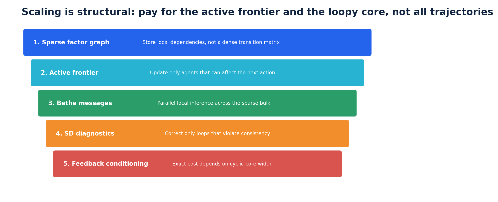
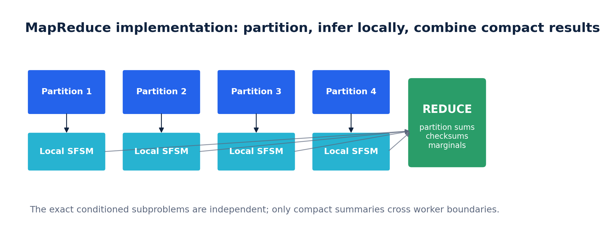

# Architecture

This document describes the software structure behind the visual explanation in [WHITEPAPER.md](WHITEPAPER.md) and the formal results in [TECHNICAL_PAPER.md](TECHNICAL_PAPER.md).

## 1. Responsibility split

The system is divided into four layers.

| Layer | Responsibility |
|---|---|
| Production runtime | execute tools, persist state, enforce identity, retries, security and rollback |
| SFSM decision service | maintain route uncertainty and select accept, verify, retry, redirect or abstain |
| Distributed inference workers | update sparse messages, solve conditioned forests and compute residuals |
| Evidence and calibration store | retain reliability models, verifier features and execution outcomes |

The SFSM does not execute a database query, payment or code action itself. It returns an action to the production runtime.

## 2. Semantic layer

### FSM

The deterministic baseline maps the current realised state and evidence to one successor. In the benchmark it returns the first actual output whose verifier score crosses a fixed threshold, with a deterministic fallback.

### SFSM

The stochastic policy maintains posterior correctness for every admissible actual output. It selects the output or next action with minimum posterior expected loss. The reference benchmark uses a closed-form posterior score derived from reliability priors and verifier likelihoods.

## 3. Data model

The reference implementation uses arrays rather than one Python object per agent.

```text
correct[component, agent]   evaluator-only label
scores[component, agent]    verifier observation
priors[component, agent]    reliability prior
selected[component]         returned output index
```

Production deployments replace the benchmark arrays with sparse graph records:

```text
variable table
factor table
compressed adjacency
message arrays
active-frontier bitmap
separator records
evidence event log
```

## 4. Inference pipeline

<p align="center"></p>

1. Compile eligible actions and current evidence into a sparse factor graph.
2. Restrict computation to the active frontier.
3. Run local Bethe message updates.
4. Evaluate Schwinger-Dyson residuals around loops.
5. Condition or enlarge only the high-residual cyclic regions.
6. Reduce conditioned partition contributions and marginals.
7. Select one executable action and return it to the runtime.

## 5. MapReduce layer

<p align="center"></p>

The included implementation partitions independent output-selection rows across workers. Each mapper opens read-only NumPy memory maps and returns compact checksums. The benchmark verifies that distributed and serial selections are identical before timing is accepted.

The same contract generalizes to exact feedback conditioning. A mapper receives one feedback assignment or graph shard and returns a log partition contribution plus requested marginal numerators. The reducer combines them with stable log-domain arithmetic.

## 6. Streaming architecture

A long-running workflow should retain only:

- current state distribution;
- active-frontier variables and factors;
- cached local and separator messages;
- current evidence features;
- compact audit metadata.

Old raw outputs remain in an external event or object store. They do not need to stay inside the inference graph.

## 7. Failure model

Map tasks are deterministic functions of immutable inputs and explicit seeds. They are therefore retryable and idempotent. Reducers validate task IDs, counts, shapes and checksums. If the feedback budget is exhausted before loops are removed, the system returns the best current approximation with its residual diagnostics rather than claiming exactness.

## 8. Extension points

The package is intentionally small. Typical extensions are:

- replace the beta verifier model with calibrated classifiers;
- add task-conditional reliability priors;
- represent abstention, verification and retry as explicit actions;
- compile arbitrary sparse factor graphs;
- replace the local process pool with Ray, Spark, Dask, Kubernetes jobs or custom services;
- add persistent message caches and online recalibration.
