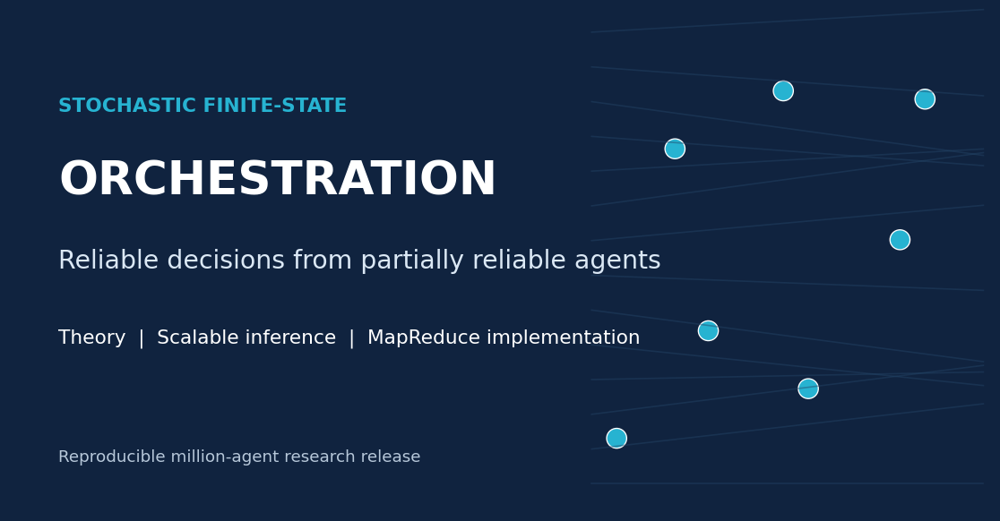
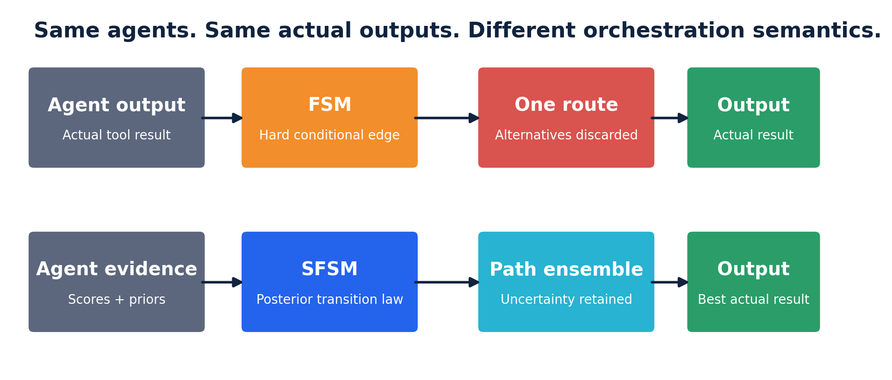
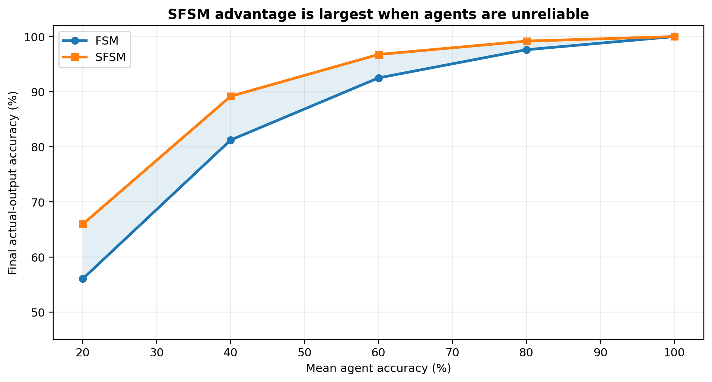

<p align="center"></p>

# Stochastic Finite-State Orchestration

A complete, Markdown-first release of the theory, implementation and reproducible experiments for **FSM versus SFSM orchestration of partially reliable agents**.

## Read first

- **[WHITEPAPER.md](WHITEPAPER.md)** - full visual white paper for software engineers, architects and technical leaders.
- **[TECHNICAL_PAPER.md](TECHNICAL_PAPER.md)** - complete theorem-and-proof treatment in GitHub-renderable Markdown.
- **[REPRODUCIBILITY.md](REPRODUCIBILITY.md)** - exact commands, expected outputs and verification rules.
- **[IMPLEMENTATION_GUIDE.md](IMPLEMENTATION_GUIDE.md)** - how to integrate, extend and deploy the code.

No PDF, LaTeX source or hidden GitHub workflow directory is included.

## Core distinction

A deterministic finite-state machine executes one hard successor transition after each realised output. A stochastic finite-state machine retains a probability law over admissible routes and uses reliability, verifier evidence, cost and constraints before committing to one executable action.

Both policies obey the same terminal contract:

> The final result must be an actual output produced by an executed agent or tool. The benchmark does not create a new answer by majority vote or synthesis.

<p align="center"></p>

## Reference result

The reference workload contains 125,000 independent sparse components with eight agent nodes each, giving exactly **1,000,000 agent nodes per accuracy condition**.

| Mean agent accuracy | FSM final accuracy | SFSM final accuracy | Gain |
|---:|---:|---:|---:|
| 20% | 56.05% | **65.96%** | **+9.91 pp** |
| 40% | 81.23% | **89.17%** | **+7.94 pp** |
| 60% | 92.50% | **96.75%** | **+4.25 pp** |
| 80% | 97.61% | **99.18%** | **+1.56 pp** |
| 100% | 100.00% | **100.00%** | 0.00 pp |

<p align="center"></p>

## Reproduce in three commands

```bash
python -m venv .venv
source .venv/bin/activate          # Windows: .venv\Scripts\activate
python -m pip install -r requirements-dev.txt
python -m pip install -e . --no-build-isolation --no-deps
```

Then run:

```bash
make test          # semantic and serial/MapReduce equivalence tests
make quick         # reduced end-to-end experiment
make reproduce     # complete reference experiment suite
make verify        # compare generated accuracy against frozen references
make figures       # regenerate result plots
```

The same actions are available without `make`:

```bash
python experiments/run_all.py --profile quick
python experiments/run_all.py --profile full
```

## Repository contents

```text
WHITEPAPER.md                  complete engineering white paper
TECHNICAL_PAPER.md             full technical paper with proofs
ARCHITECTURE.md                system structure and execution model
REPRODUCIBILITY.md             experiment contract and commands
IMPLEMENTATION_GUIDE.md        integration and extension instructions
src/sfsm_orchestration/        installable serial and distributed implementation
experiments/                    complete runners, configs and exactness validation
results/reference/             frozen raw and aggregate results
figures/                       explanatory and experimental figures
social/                        LinkedIn banner and release text
tests/                         semantic and distributed-equivalence tests
Dockerfile                     isolated quick reproduction
environment.yml                Conda environment
requirements*.txt              pinned Python dependencies
pyproject.toml                 package and CLI metadata
SHA256SUMS                     release integrity manifest
```

## Scientific boundary

This release demonstrates that calibrated stochastic orchestration can improve the selection of actual outputs when agents are partially reliable and informative evidence is available. It does not claim that every dense million-agent graph is tractable, that calibration is automatic, or that probabilistic inference replaces production security, persistence or tool execution.

See [CITATION.cff](CITATION.cff) for citation metadata.
