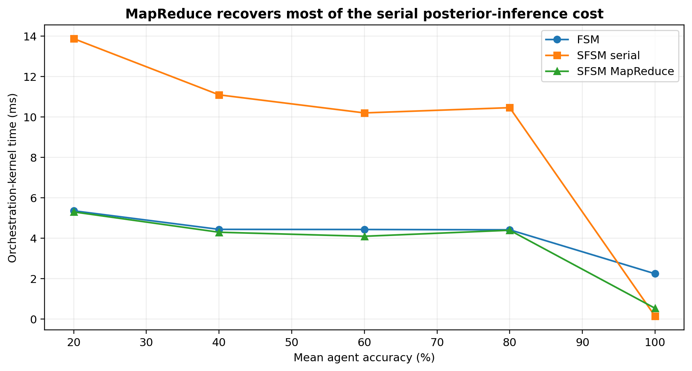
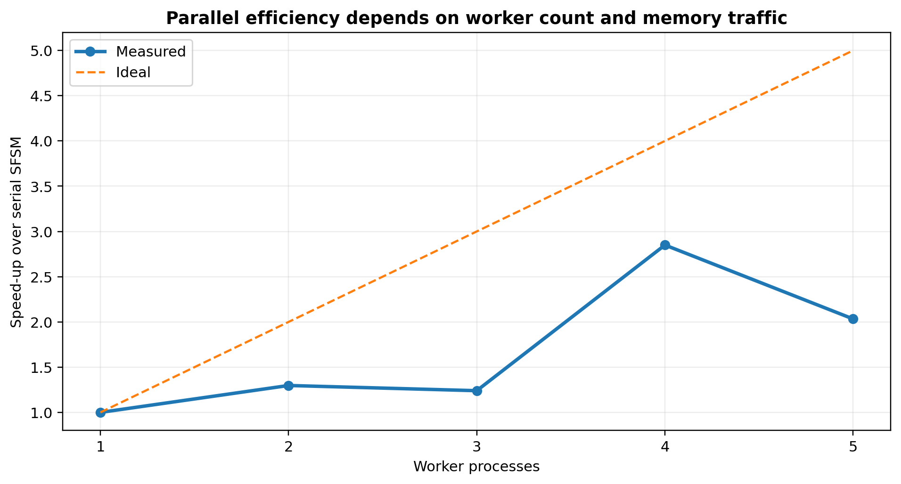

# Stochastic Finite-State Orchestration of Partially Reliable Agents

## Information limits, field-theoretic inference, and MapReduce at million-agent scale

**Angshul Majumdar**  
Department of Electronics and Communication Engineering  
Indraprastha Institute of Information Technology Delhi  
angshul@iiitd.ac.in

> This is the complete technical paper in GitHub-renderable Markdown. For the visual, procedural engineering treatment, read [WHITEPAPER.md](WHITEPAPER.md).

## Abstract

Large agent systems are ordinarily implemented as deterministic finite-state machines (FSMs): a realised tool output updates state, a hard conditional edge selects one successor, and one route is executed. This semantics is brittle when agents are only partially reliable. We formulate orchestration as a stochastic finite-state machine (SFSM) whose terminal decision must remain an actual output produced by an executed agent or tool. The restriction eliminates artificial gains from voting or answer synthesis and yields sharp information-theoretic limits. We prove a no-information impossibility theorem, a Fano lower bound for output identification, Bayes optimality among admissible selectors, an oracle ceiling, exact accuracy formulae under monotone-likelihood verifiers, calibration-regret bounds, and strict dominance conditions over hard FSM routing. The trajectory posterior is represented by a Euclidean Feynman-Kac path integral, approximated by Bethe free energy, and certified or corrected through Schwinger-Dyson identities. We establish tree exactness, feedback-conditioned exactness, active-frontier truncation bounds, separator elimination, distributed contraction guarantees, communication lower bounds, and MapReduce work-span complexity. A complete implementation uses sparse factor graphs, log-domain messages, Schwinger-Dyson loop localization, parallel feedback conditioning, and an idempotent reducer. Exactness is verified on 270 loopy models. A separate graph with one million agent nodes shows that SFSM posterior selection improves final actual-output accuracy over FSM routing by 9.91, 7.94, 4.25, and 1.56 percentage points at mean agent accuracies 0.2, 0.4, 0.6, and 0.8; both reach 1.0 at perfect agents. Four-worker MapReduce reduces serial SFSM orchestration time by approximately 2.4-2.7 times in the nondegenerate regimes.

**Keywords:** agent orchestration; stochastic finite-state machines; partially reliable agents; factor graphs; Feynman-Kac formula; Bethe free energy; Schwinger-Dyson equations; distributed inference; MapReduce.

---

# Introduction

Agent orchestration is a control problem under unreliable computation. A language model, retriever, code executor, database tool, verifier, or human intervention may return a correct output, an incorrect but plausible output, or a failure. Nevertheless, most graph orchestrators commit to one realised state transition. Their mathematical semantics is therefore that of a finite-state machine (FSM): nodes transform state and fixed or conditional edges select the next node. LangGraph makes this structure explicit through state, nodes, and edges (LangChain 2026a). It is a useful implementation example, but it is not the mathematical baseline of this paper. The baseline is the deterministic FSM itself.

The distinction between graph logic and production infrastructure is also important. Open-source graph code may define the routing logic, while containerization, identity, persistent state, security isolation, observability, scaling, and lifecycle management are supplied by custom production code or managed control planes. Microsoft explicitly lists these cross-cutting responsibilities when open-source agent frameworks are hosted directly, and its hosted-agent service supplies them as platform functions (Microsoft 2026). Google describes Vertex AI Agent Engine as the managed service that deploys, manages, and scales agent code in production (Google Cloud 2026); Amazon similarly separates agent logic from the runtime that provides isolation, sessions, scaling, identity, and observability (Amazon Web Services 2026). Our comparison therefore isolates *FSM versus SFSM semantics*; it does not time the incidental overhead of any Python package.

A deterministic FSM is appropriate when the components are reliable or when every uncertainty has already been resolved before the transition is made. Partially reliable agents violate this premise. A hard edge collapses uncertainty at each step, even when several routes remain plausible and the evidence distinguishing them is weak. A stochastic finite-state machine (SFSM) instead maintains $$P(a_t,x_{t+1}\mid x_t,y_{0:t}),$$ a normalized transition law over the next agent and state. The final action may select, verify, retry, redirect, or abstain, but it must return an *actual output* produced by an executed tool or agent. It may not manufacture a new answer by majority voting over outputs. This admissibility condition is central: it separates orchestration from ensemble answer synthesis and makes the accuracy claims operationally meaningful.

The resulting probabilistic object is a distribution over complete state–agent trajectories. We study it through three mathematically consistent views. The Feynman–Kac view gives the exact global path sum. The Bethe view yields sparse local inference by free-energy minimization. The Schwinger–Dyson view gives exact identities that diagnose and correct closure error. This unification is not terminology: all three constructions act on the same trajectory action.

The second problem is scale. A global trajectory law is useless if it requires trajectory enumeration or a dense transition matrix. We therefore develop a streaming sparse implementation. Only the active frontier is retained; the factor graph is stored in compressed sparse form; local Bethe messages are distributed across graph partitions; Schwinger–Dyson residuals identify the cyclic core; and feedback assignments or graph shards are processed by MapReduce. Exactness is exponential only in feedback width and separator width, not in the total number of registered agents.

The main contributions are as follows.

- We formalize deterministic FSM and stochastic FSM orchestration while imposing actual-output admissibility.

- We prove no-information and Fano impossibility bounds, Bayes optimality among actual-output selectors, an oracle ceiling, exact verifier-based accuracy laws, and calibration-regret bounds.

- We prove that deterministic kernels are precisely the vertices of the stochastic transition polytope and that hard routing is the zero-temperature limit of the trajectory Gibbs law.

- We derive the Feynman–Kac path integral, Gibbs variational principle, response identities, transfer-spectrum asymptotics, and posterior Doob transform.

- We derive Bethe inference, tree exactness, a linked forest expansion, discrete and continuous Schwinger–Dyson equations, Ward identities, residual certificates, completeness, and an effective-action Dyson equation.

- We establish feedback-conditioned exactness and extend it to active-frontier filtering, separator elimination, asynchronous distributed inference, quantized messages, and bounded-memory streaming.

- We give a MapReduce implementation with exact reducers, load-balanced work–span bounds, idempotent fault recovery, and a worst-case separator communication lower bound.

- We verify exact posterior recovery on 270 sparse loopy models and evaluate FSM versus SFSM on one graph containing exactly one million agent nodes. All code, seeds, raw tables, and diagrams accompany the manuscript.

# Related Work

Probabilistic automata have been studied since Rabin’s finite-state formulation (Rabin 1963), while partially observed stochastic control provides a general decision-theoretic model for latent state and sequential evidence (Kaelbling, Littman, and Cassandra 1998). The present problem is narrower in one respect and harder in another: the state is an orchestration state, terminal actions are restricted to actual tool outputs, and the induced graph may contain long-range verifier, resource, and consistency factors. The Blackwell comparison of experiments (Blackwell 1953) underlies our evidence-dominance result, while proper scoring rules provide the correct evaluation of posterior claims (Gneiting and Raftery 2007).

Factor graphs and sum–product inference provide the local computational language (Kschischang, Frey, and Loeliger 2001); Bethe and region free energies connect message passing to variational inference (Yedidia, Freeman, and Weiss 2005; Wainwright and Jordan 2008). Existing convergence theory gives sufficient conditions for unique loopy-belief-propagation fixed points (Mooij and Kappen 2007). Our contribution is to embed these local methods inside an exact path law and to use Schwinger–Dyson identities and feedback conditioning as a systematic correction hierarchy.

Recent language-model methods generate several reasoning paths, act through tools, or aggregate multiple chains (Wang et al. 2023; Yao, Yu, et al. 2023; Yao, Zhao, et al. 2023). Those methods motivate branching computation but do not by themselves define a normalized stochastic finite-state semantics over dependent tool trajectories. Moreover, self-consistency and majority aggregation may produce a terminal answer that is not an actual tool output; our admissibility condition explicitly excludes that operation. At scale, the implementation draws on MapReduce (Dean and Ghemawat 2004) and vertex-centric graph processing (Malewicz et al. 2010), but the mapped quantities are conditional partition functions, marginals, and Schwinger–Dyson residuals rather than ordinary graph statistics.

# Execution Graphs and Probabilistic Semantics

## Deterministic orchestration

Let $\mathcal X$ be a finite set of orchestration states, $\mathcal A$ a finite set of agents or tools, $\mathcal U$ an input space, and $\mathcal O$ an output space. A deterministic orchestration machine is a tuple $$\mathfrak M_{\rm det}=(\mathcal X,\mathcal A,f,g,\mu),$$ where $\mu$ is an initial-state distribution, $g:\mathcal X\times\mathcal U\to\mathcal A$ selects the next agent, and $$f:\mathcal X\times\mathcal A\times\mathcal O\to\mathcal X$$ updates the orchestration state after the agent returns an output. If the agent output is itself deterministic, the entire execution is fixed by the initial state and input. If an agent is stochastic, the runtime still conditions subsequent execution on the one output that was realised.

This abstraction includes ordinary finite-state controllers and graph workflows. Nodes correspond to state-conditioned computations; edges correspond to transition rules. Conditional edges may be arbitrarily complicated, and node code may itself be random. The point is therefore not that a graph runtime is computationally unable to simulate stochasticity. The point is that the graph specification alone does not force the programmer to define or maintain a global probability law over all unexecuted alternatives.

## Stochastic finite-state orchestration

**Definition 1** (Stochastic finite-state orchestration). *A finite-horizon stochastic orchestration model of horizon $H$ is $$\mathfrak M=(\mathcal X,\mathcal A,\mathcal Z,\mathcal Y,\mu,\{K_t\}_{t=0}^{H-1},\{L_t\}_{t=0}^{H},U),$$ where*

- *$x_t\in\mathcal X$ is the orchestration state;*

- *$a_t\in\mathcal A$ is the selected agent or tool;*

- *$z_t\in\mathcal Z_t\subseteq\mathbb R^{d_t}$ is an optional continuous internal variable, such as a score vector or latent message representation;*

- *$y_t\in\mathcal Y_t$ is observed evidence;*

- *$\mu$ is the initial distribution;*

- *$K_t(a_t,x_{t+1},z_{t+1}\mid x_t,z_t)$ is a transition density or mass function;*

- *$L_t(y_t\mid x_t,a_t,z_t)$ is an evidence likelihood;*

- *$U(x_H,z_H)$ is a terminal utility or terminal potential.*

The complete latent trajectory is $$\tau=(x_0,z_0,a_0,x_1,z_1,a_1,\ldots,a_{H-1},x_H,z_H).$$ For fixed observations $y_{0:H}$, the unnormalized trajectory weight is $$\begin{aligned}
W(\tau;y_{0:H})
&=\mu(x_0,z_0)L_0(y_0\mid x_0,z_0)U(x_H,z_H)\\
&\quad\times\prod_{t=0}^{H-1}
K_t(a_t,x_{t+1},z_{t+1}\mid x_t,z_t)
L_{t+1}(y_{t+1}\mid x_{t+1},a_t,z_{t+1}).

\end{aligned}$$ Additional factors may encode latency, monetary cost, prerequisite satisfaction, safety constraints, agreement between agents, or penalties for revisiting states.

**Definition 2** (Posterior trajectory law). *The posterior law over trajectories is $$\pi(\tau\mid y_{0:H})=\frac{W(\tau;y_{0:H})}{Z(y_{0:H})},
\qquad
Z(y_{0:H})=\sum_{x_{0:H},a_{0:H-1}}\int W(\tau;y_{0:H})\,\mathrm dz_{0:H}.$$*

**Theorem 1** (Deterministic inclusion and strictness). *Every deterministic finite-state orchestration machine is representable as a stochastic finite-state orchestration model. Moreover, the stochastic model class is strictly larger whenever there exists a state and input for which two distinct successor pairs $(a,x')$ have positive conditional probability.*

*Proof.* For a deterministic selector $g$ and transition $f$, set $$K(a,x'\mid x,u,o)=\mathbf 1\{a=g(x,u)\}\mathbf 1\{x'=f(x,a,o)\}.$$ The induced stochastic law is a point mass on the deterministic execution. Conversely, a nondegenerate conditional distribution assigning positive mass to two distinct successor pairs cannot equal a point mass and therefore is not representable by a deterministic transition function without introducing an additional random variable into the state. Hence the stochastic semantic class is strictly larger on the original state space. ◻

*Remark 1*. This is a statement about model classes, not Turing expressivity. A general-purpose graph runtime can sample from the stochastic kernel if instructed to do so. The distinction is whether the probability law is part of the orchestration semantics and is propagated globally.

**Proposition 1** (Transition-polytope geometry). *Fix finite $\mathcal X$ and $\mathcal A$, and write $r=|\mathcal A||\mathcal X|$. The set of one-step orchestration kernels $$\mathcal K=\prod_{x\in\mathcal X}\Delta_{r-1}$$ is a compact convex polytope of dimension $|\mathcal X|(r-1)$. Its extreme points are exactly the deterministic state–agent transition rules. Consequently every stochastic orchestration kernel is a convex combination of deterministic kernels; moreover, it is a convex combination of at most $|\mathcal X|(r-1)+1$ deterministic kernels.*

*Proof.* For each current state $x$, the row $K(\cdot,\cdot\mid x)$ belongs to the simplex $\Delta_{r-1}$. The extreme points of a simplex are its coordinate vectors, and the extreme points of a finite Cartesian product of polytopes are products of their extreme points. Hence an extreme kernel has one unit entry in every row and is therefore deterministic. Conversely every deterministic kernel is such a product vertex. The convex-hull statement follows because a polytope is the convex hull of its vertices. The final bound is Carathéodory’s theorem in the affine dimension $|\mathcal X|(r-1)$. ◻

This identifies the exact geometric advantage of stochastic orchestration: an FSM occupies a vertex, whereas an SFSM occupies the full transition polytope and may therefore retain mixtures of mutually exclusive future executions without first collapsing them to a single route.

**Theorem 2** (Entropy of stochastic branching). *Consider the finite, unconditioned discrete SFSM law with trajectory $\mathsf T=(X_0,A_0,X_1,\ldots,A_{H-1},X_H)$. Then $$H(\mathsf T)
=H(X_0)+\sum_{t=0}^{H-1}
\mathbb E\!\left[H\!\left(K_t(\cdot,\cdot\mid X_t)\right)\right].
$$ The process is deterministic conditional on $X_0$ if and only if every conditional-entropy term in <a href="#eq:trajectory-entropy" data-reference-type="eqref" data-reference="eq:trajectory-entropy">[eq:trajectory-entropy]</a> vanishes.*

*Proof.* Apply the entropy chain rule and the Markov property: $$H(\mathsf T)=H(X_0)+\sum_{t=0}^{H-1}H(A_t,X_{t+1}\mid X_{0:t},A_{0:t-1})
=H(X_0)+\sum_{t=0}^{H-1}H(A_t,X_{t+1}\mid X_t).$$ The last conditional entropy is the expectation of the row entropy of $K_t$. A finite distribution has zero entropy exactly when it is a point mass, which proves the final assertion. ◻

# Actual-Output Admissibility and Information Limits

The orchestrator observes outputs produced by executed agents. Let $Y_1,\ldots,Y_m$ be these outputs, $C_i\in\{0,1\}$ indicate whether $Y_i$ is correct for the task, and $E$ collect all admissible evidence: historical reliability, verifier scores, route state, latency, provenance, and inter-agent dependence. The ground truth used to define $C_i$ is not itself available to the orchestrator.

**Definition 3** (Actual-output admissible policy). *An orchestration policy is actual-output admissible if its terminal action is an index $$I=\delta(E,Y_{1:m})\in\{1,\ldots,m\}\cup\{\bot\},$$ and its non-abstaining terminal output is exactly $Y_I$. The symbol $\bot$ denotes abstention. The policy may choose which agents to execute, but it may not synthesize a new terminal string from several outputs.*

This definition permits retries, verifiers, branching, and posterior selection. It excludes the erroneous experiment in which an orchestrator is credited with an answer obtained by majority vote even though no tool produced that answer.

**Theorem 3** (No-information impossibility). *Suppose $$P(C_i=1\mid E,Y_{1:m})=p$$ almost surely for every $i$. Then every non-abstaining actual-output admissible policy has accuracy $p$.*

*Proof.* For any selected index $I$ measurable with respect to $(E,Y_{1:m})$, $$P(C_I=1)=\mathbb E\!\left[P(C_I=1\mid E,Y_{1:m},I)\right]=\mathbb E[p]=p.$$ Thus repeated calls alone do not improve accuracy when the evidence carries no information about which output is correct. ◻

**Theorem 4** (Fano identification lower bound). *Assume exactly one of $m\ge2$ produced outputs is correct, its index $J$ is uniform on $\{1,\ldots,m\}$, and $E$ is all information available to an admissible selector $\widehat J(E)$. Then $$P(\widehat J\ne J)\ge 1-\frac{I(J;E)+\log 2}{\log m}.$$*

*Proof.* This is Fano’s inequality applied to the $m$-ary identification problem (Cover and Thomas 2006). It shows that large candidate sets are not useful unless the verifier and route evidence convey commensurate mutual information about correctness. ◻

Define the posterior correctness probabilities $$r_i(E)=P(C_i=1\mid E,Y_{1:m}).$$

**Theorem 5** (Bayes-optimal actual-output selection). *Under zero–one terminal loss and no abstention, the optimal admissible selector is $$I^*(E)\in\operatorname*{arg\,max}_{1\le i\le m}r_i(E),$$ and its accuracy is $$A^*=\mathbb E\left[\max_i r_i(E)\right].$$ Every FSM selector $I_{\rm F}$ satisfies $$P(C_{I_{\rm F}}=1)\le A^*,$$ with strict inequality whenever it fails to select a posterior maximizer on a positive-probability set having a unique maximizer.*

*Proof.* Conditioned on the evidence, selecting output $i$ incurs expected zero–one loss $1-r_i(E)$. Pointwise minimization gives the rule and accuracy. Averaging the pointwise inequality proves dominance; uniqueness gives strictness. ◻

**Corollary 1** (Value of orchestration information). *For fixed prior reliabilities $p_i=P(C_i=1)$, $$\mathbb E[\max_i r_i(E)]\ge \max_i p_i.$$ Equality holds when the evidence never changes the identity or value of the best candidate; strict improvement requires informative evidence.*

*Proof.* The function $x\mapsto\max_i x_i$ is convex, so Jensen’s inequality gives $\mathbb E[\max_i r_i]\ge\max_i\mathbb E[r_i]=\max_i p_i$. ◻

**Theorem 6** (Oracle ceiling). *If $C_1,\ldots,C_m$ are independent with $P(C_i=1)=p_i$, then every actual-output admissible selector satisfies $$P(C_I=1)\le P\left(\max_i C_i=1\right)
=1-\prod_{i=1}^m(1-p_i).$$ Equality is possible only if the evidence identifies a correct output whenever at least one exists.*

*Proof.* The event $\{C_I=1\}$ is contained in $\{\max_iC_i=1\}$. Independence gives the product formula. ◻

**Assumption 1** (Monotone-likelihood verifier). *A scalar verifier score $S_i$ has conditional densities $f_1$ and $f_0$ under $C_i=1$ and $C_i=0$, respectively, and the likelihood ratio $f_1(s)/f_0(s)$ is nondecreasing.*

**Theorem 7** (Posterior score rule). *Under independent candidates with reliability priors $p_i$, the posterior odds are $$\frac{P(C_i=1\mid S_i=s)}{P(C_i=0\mid S_i=s)}
=\frac{p_i}{1-p_i}\frac{f_1(s)}{f_0(s)}.$$ Consequently the Bayes SFSM selects the actual output maximizing this quantity. For equal priors it selects the maximum verifier score.*

*Proof.* The identity is Bayes’ rule. Monotonicity preserves the ordering for equal priors. ◻

**Theorem 8** (Exact SFSM accuracy under equal reliabilities). *Let the $m$ candidates be independent, each correct with probability $p$, and suppose the monotone score is continuous. Let $F_1,F_0$ denote the score distribution functions conditioned on correctness and error. Then maximum-posterior selection has exact accuracy $$A_{\rm S}(m,p)=mp\int f_1(s)
\left[pF_1(s)+(1-p)F_0(s)\right]^{m-1}\,\mathrm ds.
\label{eq:sfsm-accuracy}$$*

*Proof.* By symmetry, multiply by $m$ the probability that candidate one is correct, has score $s$, and every other mixture-distributed score is at most $s$. Integration gives <a href="#eq:sfsm-accuracy" data-reference-type="eqref" data-reference="eq:sfsm-accuracy">[eq:sfsm-accuracy]</a>. ◻

**Theorem 9** (Exact hard-threshold FSM accuracy). *For the sequential FSM that returns the first score at least $\theta$ and otherwise returns the first output, define $$a=p\{1-F_1(\theta)\},\qquad
b=(1-p)\{1-F_0(\theta)\},\qquad q=1-a-b.$$ Its exact accuracy is $$A_{\rm F}(m,p,\theta)
=a\frac{1-q^m}{1-q}+pF_1(\theta)q^{m-1},
\label{eq:fsm-accuracy}$$ with the continuous extension $A_{\rm F}=p$ when $q=1$.*

*Proof.* The first term sums the disjoint events in which the first threshold crossing occurs at position $k$ and is correct: $\sum_{k=1}^m q^{k-1}a$. If no candidate crosses, the fallback is correct exactly when the first candidate is correct below threshold and the remaining $m-1$ scores are also below threshold, which has probability $pF_1(\theta)q^{m-1}$. ◻

**Corollary 2** (SFSM dominance over threshold FSM). *Under the preceding model, $$A_{\rm S}(m,p)\ge \sup_{\theta}A_{\rm F}(m,p,\theta).$$ The inequality is strict whenever the posterior-maximizing candidate differs from every threshold-first rule on an event of positive probability.*

**Theorem 10** (Calibration-regret bound). *Let $r_i$ be the true posterior correctness probabilities, let $\widehat r_i$ be estimated probabilities, and choose $\widehat I\in\operatorname*{arg\,max}_i\widehat r_i$. Then, pointwise, $$\max_i r_i-r_{\widehat I}\le 2\|r-\widehat r\|_\infty.$$ Hence the excess error probability of the implemented SFSM relative to the Bayes selector is at most $$2\mathbb E\|r-\widehat r\|_\infty.$$*

*Proof.* Let $i^*\in\operatorname*{arg\,max}_i r_i$. Then $r_{i^*}-r_{\widehat I}\le(r_{i^*}-\widehat r_{i^*})+(\widehat r_{\widehat I}-r_{\widehat I})$ because $\widehat r_{\widehat I}\ge\widehat r_{i^*}$. Each term is bounded by the sup norm. ◻

# The Feynman Path Integral of an Agent System

## Action representation

Whenever $W(\tau;y)>0$, define the Euclidean action $$S(\tau;y)=-\log W(\tau;y).$$ Hard constraints are represented by $S=+\infty$. The normalizing constant becomes $$Z(y)=\sum_{x_{0:H},a_{0:H-1}}\int_{\mathcal Z_0\times\cdots\times\mathcal Z_H}
\exp\{-S(\tau;y)\}\,\mathrm dz_{0:H}.
\label{eq:path-integral}$$ Equation <a href="#eq:path-integral" data-reference-type="eqref" data-reference="eq:path-integral">[eq:path-integral]</a> is a finite-state Euclidean path integral. It is the discrete counterpart of the Feynman–Kac representation (Feynman 1948; Kac 1949; Feynman and Hibbs 1965). The word “path” is literal: each term corresponds to a complete orchestration trajectory. The word “integral” covers both the sum over discrete state–agent paths and integration over continuous internal variables.

## Euclidean variational and response structure

For a finite trajectory space $\Omega$, let $q$ range over all probability laws on $\Omega$ and define the Euclidean free-energy functional $$\mathfrak F_S(q)=\mathbb E_q[S]-H(q).$$

**Theorem 11** (Gibbs variational principle). *For $\pi(\omega)=Z^{-1}e^{-S(\omega)}$, $$-\log Z=\inf_q\mathfrak F_S(q),
\qquad
\mathfrak F_S(q)+\log Z=\operatorname{KL}(q\|\pi).
\label{eq:gibbs-variational}$$ The unique minimizer on the support of $e^{-S}$ is $q=\pi$.*

*Proof.* Since $\log\pi=-S-\log Z$, $$\operatorname{KL}(q\|\pi)=\sum_\omega q(\omega)\log q(\omega)+\mathbb E_q[S]+\log Z
=\mathfrak F_S(q)+\log Z.$$ Nonnegativity and strict definiteness of relative entropy give the result. ◻

Thus the posterior path law is not merely normalized by a path integral: it is the unique equilibrium law minimizing action minus entropy. Hard routing suppresses the entropic term by restricting $q$ to point masses.

**Theorem 12** (Exact response calculus). *Let $S_\lambda=S+\lambda V$, $Z(\lambda)=\sum_\omega e^{-S_\lambda(\omega)}$, and let $O$ be any observable. Wherever differentiation under the finite sum is valid, $$\begin{aligned}
\frac{\,\mathrm d}{\,\mathrm d\lambda}\log Z(\lambda)
&=-\mathbb E_{\pi_\lambda}[V],\label{eq:response-one}\\
\frac{\,\mathrm d^2}{\,\mathrm d\lambda^2}\log Z(\lambda)
&=\operatorname{Var}_{\pi_\lambda}(V),\label{eq:response-two}\\
\frac{\,\mathrm d}{\,\mathrm d\lambda}\mathbb E_{\pi_\lambda}[O]
&=-\operatorname{Cov}_{\pi_\lambda}(O,V).
\label{eq:linear-response}
\end{aligned}$$*

*Proof.* Differentiate the normalized exponential family directly. The score is $\partial_\lambda\log\pi_\lambda=-V+\mathbb E_{\pi_\lambda}[V]$. Multiplying it by $O$ and averaging gives <a href="#eq:linear-response" data-reference-type="eqref" data-reference="eq:linear-response">[eq:linear-response]</a>; the first two identities follow by taking $O=1$ and $O=V$. ◻

Equation <a href="#eq:linear-response" data-reference-type="eqref" data-reference="eq:linear-response">[eq:linear-response]</a> is an exact susceptibility law. It quantifies how terminal success, cost, or agent occupancy changes under an infinitesimal perturbation of reliability, latency, safety, or consistency potentials.

**Corollary 3** (Free-energy perturbation identity). *For two actions $S_0,S_1$ with partition functions $Z_0,Z_1$ and $\Delta S=S_1-S_0$, $$\mathbb E_{\pi_0}\!\left[e^{-\Delta S}\right]=\frac{Z_1}{Z_0}.
\label{eq:jarzynski}$$ Consequently, with $F_j=-\log Z_j$, $$F_1-F_0\le \mathbb E_{\pi_0}[\Delta S].$$*

*Proof.* Substitution of $\pi_0=Z_0^{-1}e^{-S_0}$ gives <a href="#eq:jarzynski" data-reference-type="eqref" data-reference="eq:jarzynski">[eq:jarzynski]</a>. Jensen’s inequality applied to $-\log$ gives the bound. This is the finite orchestration analogue of the exponential work identity (Jarzynski 1997). ◻

**Theorem 13** (Zero-temperature reduction to hard routing). *Let $\Omega$ be finite and define $$\pi_\kappa(\omega)=Z_\kappa^{-1}e^{-S(\omega)/\kappa},
\qquad \kappa>0.$$ Let $S_\star=\min_\Omega S$, let $M=\{\omega:S(\omega)=S_\star\}$, and suppose the gap $\Delta=\min_{\omega\notin M}(S(\omega)-S_\star)$ is positive. Then $$\begin{aligned}
-\kappa\log Z_\kappa&\longrightarrow S_\star,\label{eq:laplace-principle}\\
\pi_\kappa(\Omega\setminus M)
&\le \frac{|\Omega\setminus M|}{|M|}e^{-\Delta/\kappa}.
\label{eq:zero-temp-bound}
\end{aligned}$$ If the minimizer is unique, $\pi_\kappa$ converges to the deterministic MAP trajectory.*

*Proof.* Factor $e^{-S_\star/\kappa}$ out of $Z_\kappa$: $$Z_\kappa=e^{-S_\star/\kappa}
\left(|M|+\sum_{\omega\notin M}e^{-(S(\omega)-S_\star)/\kappa}\right).$$ The term in parentheses lies between $|M|$ and $|M|+|\Omega\setminus M|e^{-\Delta/\kappa}$. Taking $-\kappa\log$ proves <a href="#eq:laplace-principle" data-reference-type="eqref" data-reference="eq:laplace-principle">[eq:laplace-principle]</a>; normalizing the nonminimum mass proves <a href="#eq:zero-temp-bound" data-reference-type="eqref" data-reference="eq:zero-temp-bound">[eq:zero-temp-bound]</a>. ◻

Hard FSM routing is therefore the singular zero-temperature boundary of the stochastic theory, not a competing foundation. At positive $\kappa$, the path law preserves fluctuations around the minimum-action route; at $\kappa\downarrow0$, those fluctuations are exponentially suppressed.

**Theorem 14** (One-loop semiclassical expansion). *Let $S:\mathbb R^d\to\mathbb R$ be $C^4$, coercive, and possess a unique global minimizer $z_\star$ with positive-definite Hessian $H_\star=\nabla^2S(z_\star)$. Suppose the derivatives required by the Laplace expansion are integrably dominated outside a neighbourhood of $z_\star$. Then, as $\kappa\downarrow0$, $$Z_\kappa=\int_{\mathbb R^d}e^{-S(z)/\kappa}\,\mathrm dz
=e^{-S(z_\star)/\kappa}
\frac{(2\pi\kappa)^{d/2}}{\sqrt{\det H_\star}}
\left(1+O(\kappa)\right).
\label{eq:one-loop}$$ Moreover, for the centred fluctuation $\xi=z-z_\star$, $$\mathbb E_{\pi_\kappa}[\xi]=O(\kappa),
\qquad
\operatorname{Cov}_{\pi_\kappa}(\xi)=\kappa H_\star^{-1}+O(\kappa^2).
\label{eq:gaussian-propagator}$$*

*Proof.* Write $z=z_\star+\sqrt\kappa\,u$ and expand $S(z)=S(z_\star)+\frac{\kappa}{2}u^\top H_\star u+O(\kappa^{3/2}\|u\|^3)$. Coercivity makes the contribution outside a fixed neighbourhood exponentially smaller than the saddle contribution. Dominated Taylor expansion inside the neighbourhood reduces the leading integral to the Gaussian integral $(2\pi)^{d/2}(\det H_\star)^{-1/2}$ and produces an $O(\kappa)$ relative correction. Applying the same expansion with insertions $\xi$ and $\xi\xi^\top$ gives <a href="#eq:gaussian-propagator" data-reference-type="eqref" data-reference="eq:gaussian-propagator">[eq:gaussian-propagator]</a>. This is the one-loop Laplace expansion of the Euclidean path integral (Zinn-Justin 2002). ◻

The inverse Hessian $H_\star^{-1}$ is the local orchestration propagator: it measures the coupled fluctuation of latent confidence, route scores, and internal agent states around the minimum-action execution. A hard router retains only $z_\star$ and discards this covariance.

A convenient additive decomposition is $$\begin{aligned}
S(\tau;y)
&=S_0(x_0,z_0;y_0)+S_T(x_H,z_H)\\
&\quad+\sum_{t=0}^{H-1}s_t(x_t,z_t,a_t,x_{t+1},z_{t+1};y_{t+1})
+\sum_{\alpha\in\mathcal F_{\rm long}}s_\alpha(\tau_\alpha),
\label{eq:additive-action}
\end{aligned}$$ where the last sum contains nonlocal factors such as cross-agent consistency, repeated-state penalties, shared-resource constraints, or terminal verification.

## Transfer operators

For clarity, first omit nonlocal factors. Define the one-step transfer operator $$\begin{aligned}
\mathsf K_t((x,z),(x',z'))
=\sum_{a\in\mathcal A}
\exp\{-s_t(x,z,a,x',z';y_{t+1})\}.
\end{aligned}$$ Let $\varphi_0(x,z)=\exp\{-S_0(x,z;y_0)\}$ and $r(x,z)=\exp\{-S_T(x,z)\}$. Then $$Z(y)=\langle \varphi_0,\mathsf K_0\mathsf K_1\cdots\mathsf K_{H-1}r\rangle.
\label{eq:transfer}$$

**Theorem 15** (Path-sum–propagator equivalence). *For every finite-horizon model with local additive action, the path integral <a href="#eq:path-integral" data-reference-type="eqref" data-reference="eq:path-integral">[eq:path-integral]</a> equals the transfer-operator expression <a href="#eq:transfer" data-reference-type="eqref" data-reference="eq:transfer">[eq:transfer]</a>. More generally, the endpoint kernel $$\mathsf K_{0:H}((x_0,z_0),(x_H,z_H))$$ is the sum/integral of $\exp(-S)$ over all intermediate states, agents, and continuous variables with those endpoints fixed.*

*Proof.* Expand the operator product in <a href="#eq:transfer" data-reference-type="eqref" data-reference="eq:transfer">[eq:transfer]</a>. Each matrix multiplication or integral introduces one intermediate state $(x_t,z_t)$, while each one-step kernel introduces a sum over $a_t$. Multiplication of the local kernels adds their negative logarithms, giving $\exp(-\sum_t s_t)$. Multiplication by the initial and terminal functions adds $S_0$ and $S_T$. The resulting expansion is exactly <a href="#eq:path-integral" data-reference-type="eqref" data-reference="eq:path-integral">[eq:path-integral]</a>. ◻

**Theorem 16** (Transfer-spectrum asymptotics). *Assume a finite homogeneous state space and a primitive nonnegative transfer matrix $\mathsf K$. Let $\rho>0$ be its Perron root and let $u,v>0$ be left and right Perron vectors normalized by $u^\top v=1$. For positive boundary vectors $\varphi_0,r$, $$Z_H=\langle\varphi_0,\mathsf K^Hr\rangle
=\rho^H\langle\varphi_0,v\rangle\langle u,r\rangle
+O(\widetilde\rho^{\,H}),
\label{eq:pf-asymptotics}$$ where $|\rho_2|<\widetilde\rho<\rho$ and $|\rho_2|$ is the subleading spectral modulus. Hence $$\lim_{H\to\infty}\frac1H\log Z_H=\log\rho.$$*

*Proof.* Primitivity and finite-dimensional spectral decomposition give, for every $\widetilde\rho\in(|\rho_2|,\rho)$, $\mathsf K^H=\rho^Hvu^\top+O(\widetilde\rho^{\,H})$ in any finite-dimensional operator norm (Seneta 2006). Multiplication by the boundary vectors gives <a href="#eq:pf-asymptotics" data-reference-type="eqref" data-reference="eq:pf-asymptotics">[eq:pf-asymptotics]</a>. Positivity makes the leading coefficient nonzero, and division by $H$ yields the free-energy density. ◻

The Perron root is the exponential growth rate of total viable orchestration weight. The spectral ratio $|\rho_2|/\rho$ controls the memory length of the workflow: a ratio near one signals metastable routing sectors and slow forgetting of the initial state.

**Theorem 17** (Posterior Doob transform). *Let $s_t=(x_t,z_t)$ range over a finite state space, let $\mathsf K_t(s,s')$ be nonnegative local transfer kernels, and let $r(s_H)>0$. Define backward amplitudes $$h_H=r,
\qquad
h_t(s)=\sum_{s'}\mathsf K_t(s,s')h_{t+1}(s').$$ Whenever $h_t(s)>0$, define $$\widehat K_t(s,s')
=\frac{\mathsf K_t(s,s')h_{t+1}(s')}{h_t(s)},
\qquad
\widehat\mu(s)=\frac{\varphi_0(s)h_0(s)}{Z}.
\label{eq:doob-transform}$$ Then each $\widehat K_t$ is stochastic and the exact normalized path-integral law satisfies $$\pi(s_{0:H})=\widehat\mu(s_0)
\prod_{t=0}^{H-1}\widehat K_t(s_t,s_{t+1}).$$*

*Proof.* The row sum of $\widehat K_t$ equals $h_t(s)/h_t(s)=1$. Furthermore, $$\begin{aligned}
\widehat\mu(s_0)\prod_{t=0}^{H-1}\widehat K_t(s_t,s_{t+1})
&=\frac{\varphi_0(s_0)h_0(s_0)}{Z}
\prod_{t=0}^{H-1}
\frac{\mathsf K_t(s_t,s_{t+1})h_{t+1}(s_{t+1})}{h_t(s_t)}\\
&=\frac1Z\varphi_0(s_0)
\prod_{t=0}^{H-1}\mathsf K_t(s_t,s_{t+1})r(s_H),
\end{aligned}$$ where the $h_t$ terms telescope. The final expression is the normalized path weight. ◻

Thus exact posterior orchestration can itself be executed sequentially: future evidence and terminal utility appear as the harmonic function $h_t$, which twists the original transition law into the posterior-optimal transition kernel.

Thus dynamic programming is not a competing idea; it is the exact evaluation of a path integral when the action has chain structure. Long-range factors destroy the simple chain factorization and motivate general factor-graph inference.

## Loops and infinite paths

A runtime may revisit a state. To define an infinite-horizon path sum, introduce a nonnegative per-transition penalty. Let $\mathcal T_n$ denote the set of admissible trajectories of length $n$ and let $w(\tau)=\exp(-S(\tau))$.

**Assumption 2** (Growth–decay condition). *There exist constants $C,M>0$, $\rho\ge 1$, and $0<\eta<1$ such that $$|\mathcal T_n|\le C\rho^n,
\qquad
0\le w(\tau)\le M\eta^n
\quad\text{for every }\tau\in\mathcal T_n,$$ and $\rho\eta<1$.*

**Theorem 18** (Absolute convergence and truncation). *Under the growth–decay condition, $$Z_\infty=\sum_{n=0}^{\infty}\sum_{\tau\in\mathcal T_n}w(\tau)$$ converges absolutely. The truncation error after length $H$ satisfies $$0\le Z_\infty-Z_H
\le \frac{CM(\rho\eta)^{H+1}}{1-\rho\eta}.$$*

*Proof.* For each $n$, $$\sum_{\tau\in\mathcal T_n}w(\tau)\le |\mathcal T_n|M\eta^n\le CM(\rho\eta)^n.$$ The result follows from comparison with a geometric series and summing its tail. ◻

A loop penalty $\lambda>\log\rho$ gives $\eta=e^{-\lambda}$ and therefore guarantees convergence. This is a global normalization condition, not a heuristic recursion cap.

## Real-time extension

One may formally define a complex amplitude $$\mathcal K=\sum_\tau\int \exp\{iS_R(\tau)/\kappa\}\,\mathrm dz,$$ where $S_R$ is a real action and $\kappa$ is a scale parameter. The Euclidean law follows by analytic continuation $S_R\mapsto -iS$. Nothing in the probabilistic theory requires this complex extension. In particular, contradictory terminal labels do not cancel merely because their amplitudes have opposite phase: cancellation can occur only after an explicit measurement operator maps them into a common readout coordinate. The present paper therefore uses the nonnegative Euclidean path law for inference.

# Factorization and Bethe Inference

## The trajectory factor graph

Let $v=(v_i)_{i\in V}$ collect all state, action, and latent variables after unrolling the orchestration horizon. Suppose $$\pi(v)=\frac{1}{Z}\prod_{\alpha\in\mathcal F}\psi_\alpha(v_\alpha),
\qquad \psi_\alpha\ge 0,
\label{eq:factorization}$$ where $v_\alpha=(v_i:i\in\alpha)$. Local transition factors, evidence factors, terminal utility, cross-verifier consistency, resource constraints, and loop penalties all enter through the potentials $\psi_\alpha$.

Exact inference requires $$Z=\sum_v\prod_\alpha\psi_\alpha(v_\alpha)$$ and the associated marginals. This is tractable on chains and trees but generally exponential on loopy graphs. The Bethe approximation replaces the global distribution by locally consistent factor and variable beliefs.

**Definition 4** (Local polytope). *The local polytope $\mathcal L$ is the set of beliefs $b=\{b_\alpha,b_i\}$ satisfying $$\begin{aligned}
&b_\alpha(v_\alpha)\ge0,\quad b_i(v_i)\ge0,\\
&\sum_{v_\alpha}b_\alpha(v_\alpha)=1,\quad \sum_{v_i}b_i(v_i)=1,\\
&\sum_{v_\alpha\setminus v_i}b_\alpha(v_\alpha)=b_i(v_i),
\qquad i\in\alpha.
\end{aligned}$$*

Let $d_i$ be the number of factors containing variable $i$. The Bethe free energy is $$\begin{aligned}
F_B(b)
&=\sum_{\alpha\in\mathcal F}\sum_{v_\alpha}
 b_\alpha(v_\alpha)
 \log\frac{b_\alpha(v_\alpha)}{\psi_\alpha(v_\alpha)}\\
&\quad+\sum_{i\in V}(1-d_i)
\sum_{v_i}b_i(v_i)\log b_i(v_i).
\label{eq:bethe-free-energy}
\end{aligned}$$ The Bethe approximation is $$b^B\in\operatorname*{arg\,min}_{b\in\mathcal L}F_B(b),
\qquad
\log Z_B=-F_B(b^B).$$

## Belief propagation

The sum-product updates are $$\begin{aligned}
m_{i\to\alpha}(v_i)
&\propto\prod_{\beta\ni i,\,\beta\ne\alpha}m_{\beta\to i}(v_i),\\
m_{\alpha\to i}(v_i)
&\propto\sum_{v_\alpha\setminus v_i}
\psi_\alpha(v_\alpha)
\prod_{j\in\alpha\setminus i}m_{j\to\alpha}(v_j).
\end{aligned}$$ At a fixed point, $$\begin{aligned}
b_i(v_i)&\propto\prod_{\alpha\ni i}m_{\alpha\to i}(v_i),\\
b_\alpha(v_\alpha)&\propto\psi_\alpha(v_\alpha)
\prod_{i\in\alpha}m_{i\to\alpha}(v_i).
\end{aligned}$$

**Theorem 19** (Bethe stationarity and tree exactness). *Every positive belief-propagation fixed point is a stationary point of the Bethe free energy under the local-consistency constraints. If the factor graph is a tree, the stationary point is unique, the beliefs equal the exact marginals, and $Z_B=Z$.*

*Proof.* The constrained stationary equations of <a href="#eq:bethe-free-energy" data-reference-type="eqref" data-reference="eq:bethe-free-energy">[eq:bethe-free-energy]</a>, obtained by introducing Lagrange multipliers for normalization and marginal consistency, exponentiate to the sum-product message equations. On a factor tree, local consistency determines a unique global distribution $$q_b(v)=\frac{\prod_\alpha b_\alpha(v_\alpha)}{\prod_i b_i(v_i)^{d_i-1}}.$$ The tree entropy decomposes exactly as $$H(q_b)=\sum_\alpha H(b_\alpha)-\sum_i(d_i-1)H(b_i).$$ Consequently $F_B(b)=\operatorname{KL}(q_b\|\pi)-\log Z$. Its unique minimum is attained at $q_b=\pi$, proving exactness of the beliefs and partition function. The stationary-point correspondence is the standard Bethe–belief-propagation relation (Kschischang, Frey, and Loeliger 2001; Yedidia, Freeman, and Weiss 2005). ◻

*Remark 2*. For an unrolled SFSM without cross-time constraints, the factor graph is a chain and Bethe inference reduces to exact forward–backward recursion. Cross-agent verification, shared resources, and repeated-state constraints create loops; this is exactly where the approximation becomes nontrivial.

## Linked expansion around a feedback forest

Let $S_F$ contain all factors of a spanning forest and let $V$ collect the removed loop factors, so that $S_\lambda=S_F+\lambda V$. Denote expectation under the exactly solvable forest law by $\mathbb E_F$.

**Theorem 20** (Forest-loop cumulant expansion). *The exact partition function obeys $$Z(\lambda)=Z_F\mathbb E_F[e^{-\lambda V}].
\label{eq:forest-reweight}$$ There exists $r>0$ such that, for $|\lambda|<r$, $$\log\frac{Z(\lambda)}{Z_F}
=\sum_{n=1}^{\infty}\frac{(-\lambda)^n}{n!}
\kappa_n^F(V),
\label{eq:loop-cumulants}$$ where $\kappa_n^F(V)$ is the $n$th cumulant under the forest law. In particular, $$\log\frac{Z(\lambda)}{Z_F}
=-\lambda\mathbb E_F[V]
+\frac{\lambda^2}{2}\operatorname{Var}_F(V)
-\frac{\lambda^3}{6}\kappa_3^F(V)+\cdots.$$*

*Proof.* Factor $e^{-S_F}$ out of the path sum to obtain <a href="#eq:forest-reweight" data-reference-type="eqref" data-reference="eq:forest-reweight">[eq:forest-reweight]</a>. Taking logarithms gives the cumulant generating function of $-V$ under the forest law; its Taylor expansion is <a href="#eq:loop-cumulants" data-reference-type="eqref" data-reference="eq:loop-cumulants">[eq:loop-cumulants]</a>. ◻

If $V=\sum_{e\in E\setminus F}V_e$, multilinearity of cumulants decomposes each coefficient into connected correlations among removed loop interactions, the same linked-cluster structure underlying loop calculus (Chertkov and Chernyak 2006). The first neglected term therefore quantifies precisely which cyclic dependency is absent from the forest closure. Feedback conditioning evaluates the same object nonperturbatively by summing the cyclic variables instead of truncating <a href="#eq:loop-cumulants" data-reference-type="eqref" data-reference="eq:loop-cumulants">[eq:loop-cumulants]</a>; the benchmarked algorithm uses this finite exact realization.

# Schwinger–Dyson Identities for Orchestration

The path integral determines a normalized law, but direct evaluation may be hard. Schwinger–Dyson equations characterize its expectations without enumerating every path. In continuous field theory they arise by integration by parts. For finite orchestration variables, the correct analogue is reindexing under local bijections.

## Discrete identity

Let $\Omega$ be the finite trajectory space, $\pi(\omega)=Z^{-1}e^{-S(\omega)}$, and let $T:\Omega\to\Omega$ be a bijection. Typical transformations replace one agent choice, flip one binary decision, swap two equivalent tools, or reroute a local trajectory segment while leaving endpoints fixed. Define $$\Delta_T S(\omega)=S(T\omega)-S(\omega).$$

**Theorem 21** (Discrete Schwinger–Dyson identity). *For every function $f:\Omega\to\mathbb R$ and every bijection $T$, $$\mathbb E_\pi[f(\omega)]
=\mathbb E_\pi\left[f(T\omega)e^{-\Delta_T S(\omega)}\right].
\label{eq:discrete-sd}$$ Equivalently, $$\mathbb E_\pi\left[f(T\omega)e^{-\Delta_T S(\omega)}-f(\omega)\right]=0.$$*

*Proof.* By the definition of $\pi$, $$\begin{aligned}
\mathbb E_\pi\left[f(T\omega)e^{-\Delta_T S(\omega)}\right]
&=\frac1Z\sum_{\omega\in\Omega}e^{-S(\omega)}f(T\omega)e^{-S(T\omega)+S(\omega)}\\
&=\frac1Z\sum_{\omega\in\Omega}f(T\omega)e^{-S(T\omega)}.
\end{aligned}$$ Since $T$ is a bijection, the substitution $\eta=T\omega$ converts the last sum to $Z^{-1}\sum_\eta f(\eta)e^{-S(\eta)}=\mathbb E_\pi[f]$. ◻

For $f\equiv1$, $$\mathbb E_\pi[e^{-\Delta_T S}]=1.
\label{eq:sd-normalization}$$ For richer $f$, the identity couples moments of different orders. The resulting hierarchy is exact but generally unclosed.

## Continuous identity

Let $z\in\mathbb R^d$, $\pi(z)=Z^{-1}e^{-S(z)}$, and suppose boundary terms vanish.

**Theorem 22** (Continuous Schwinger–Dyson identity). *For every continuously differentiable test function $f$ with sufficient decay, $$\mathbb E_\pi\left[\partial_i f(z)-f(z)\partial_i S(z)\right]=0.
\label{eq:continuous-sd}$$*

*Proof.* Integrating the total derivative gives $$0=\int\partial_i(f(z)e^{-S(z)})\,\mathrm dz
=\int\left(\partial_i f-f\partial_iS\right)e^{-S}\,\mathrm dz.$$ Division by $Z$ yields <a href="#eq:continuous-sd" data-reference-type="eqref" data-reference="eq:continuous-sd">[eq:continuous-sd]</a>. ◻

Equations <a href="#eq:discrete-sd" data-reference-type="eqref" data-reference="eq:discrete-sd">[eq:discrete-sd]</a> and <a href="#eq:continuous-sd" data-reference-type="eqref" data-reference="eq:continuous-sd">[eq:continuous-sd]</a> are the finite and continuous forms of the same invariance principle. They are the orchestration analogue of the Schwinger–Dyson equations for correlation functions (Dyson 1949; Schwinger 1951a, 1951b).

## Ward identities and residual certification

Let $X(z)$ be a continuously differentiable vector field generating an infinitesimal reparameterization of latent orchestration variables.

**Theorem 23** (Ward–Takahashi identity). *Under the same decay assumptions as the continuous Schwinger–Dyson theorem, every differentiable observable $f$ satisfies $$\mathbb E_\pi\!\left[
X\!\cdot\!\nabla f
+f\,\nabla\!\cdot X
-f\,X\!\cdot\!\nabla S
\right]=0.
\label{eq:ward}$$ If the weighted measure is invariant under the flow of $X$, equivalently $\nabla\!\cdot X-X\!\cdot\!\nabla S=0$, then $$\mathbb E_\pi[X\!\cdot\!\nabla f]=0.$$*

*Proof.* Integrate the divergence $\nabla\cdot(fXe^{-S})$. Its integral is zero by the boundary condition, while expansion gives the integrand in <a href="#eq:ward" data-reference-type="eqref" data-reference="eq:ward">[eq:ward]</a>. The invariant case follows by cancellation of the last two terms. ◻

A symmetry may exchange equivalent agents, translate a latent confidence coordinate, or relabel an internal state representation without changing the action. Equation <a href="#eq:ward" data-reference-type="eqref" data-reference="eq:ward">[eq:ward]</a> then forces exact relations among the corresponding occupancies and connected correlations. Violations by approximate beliefs identify symmetry-breaking closure error.

For either a discrete transformation or a continuous vector field, write $\mathcal A_m f$ for the corresponding zero-mean Schwinger–Dyson operator.

**Theorem 24** (Schwinger–Dyson residual certificate). *Let $g$ be an observable. Suppose there exist tests $f_1,\ldots,f_M$ and coefficients $c_1,\ldots,c_M$ such that $$g-\mathbb E_\pi[g]=\sum_{m=1}^M c_m\mathcal A_m f_m.
\label{eq:stein-representation}$$ Then every approximate law $q$ satisfies $$\left|\mathbb E_q[g]-\mathbb E_\pi[g]\right|
\le \sum_{m=1}^M|c_m|
\left|\mathbb E_q[\mathcal A_m f_m]\right|.
\label{eq:sd-certificate}$$*

*Proof.* Take $q$-expectations in <a href="#eq:stein-representation" data-reference-type="eqref" data-reference="eq:stein-representation">[eq:stein-representation]</a> and apply the triangle inequality. The exact expectation of every $\mathcal A_mf_m$ is zero by the corresponding Schwinger–Dyson identity. ◻

The theorem separates two questions often conflated in approximate inference. Residuals are merely diagnostics when no representation is known; once a target observable admits <a href="#eq:stein-representation" data-reference-type="eqref" data-reference="eq:stein-representation">[eq:stein-representation]</a>, the same residuals become a quantitative error certificate.

## Completeness

A finite collection of identities is a diagnostic. A complete collection characterizes the target law.

**Theorem 25** (Characterization by discrete Schwinger–Dyson equations). *Let $\mathcal G$ be a set of bijections of $\Omega$ whose generated action is transitive on the support of $e^{-S}$. Let $q$ be a strictly positive probability mass function on that support. If $$\mathbb E_q[f(T\omega)e^{-\Delta_TS(\omega)}-f(\omega)]=0$$ for every $T\in\mathcal G$ and every function $f:\Omega\to\mathbb R$, then $q=\pi$.*

*Proof.* Fix $T$ and write the identity for arbitrary $f$. Reindexing the first expectation gives $$\sum_{\eta}f(\eta)q(T^{-1}\eta)e^{-S(\eta)+S(T^{-1}\eta)}
=\sum_\eta f(\eta)q(\eta).$$ Since this holds for all $f$, $$q(\eta)e^{S(\eta)}=q(T^{-1}\eta)e^{S(T^{-1}\eta)}$$ for every $\eta$. Hence $q(\omega)e^{S(\omega)}$ is constant along each orbit of the transformations. Transitivity gives a single constant on the support, so $q(\omega)\propto e^{-S(\omega)}$. Normalization yields $q=\pi$. ◻

This theorem justifies a systematic hierarchy. Select transformations $T_1,\ldots,T_M$ and test functions $f_1,\ldots,f_R$. The residuals $$R_{mr}(q)=\mathbb E_q\left[f_r(T_m\omega)e^{-\Delta_{T_m}S(\omega)}-f_r(\omega)\right]
\label{eq:sd-residual}$$ vanish for the exact law. Increasing the transformation and test families approaches a complete characterization.

# The Unified Feynman–Bethe–Schwinger–Dyson Calculus

The three components now fit together exactly.

1.  The action $S$ defines the exact path integral $Z=\int e^{-S}$ and the posterior trajectory law $\pi$.

2.  The factorization of $e^{-S}$ defines the Bethe free energy and message-passing approximation $b^B$.

3.  The same action defines Schwinger–Dyson residuals that are zero under $\pi$ and generally nonzero under an approximate closure.

## Schwinger–Dyson-regularized Bethe inference

Let $\mathcal R_m$ be a region large enough to evaluate the $m$th chosen identity from a collection of regional beliefs. Denote the resulting pseudo-expectation by $\widehat R_m(b)$. We define $$F_{B,\mathrm{SD}}(b)
=F_B(b)+\frac{\lambda}{2}\sum_{m=1}^M w_m\widehat R_m(b)^2,
\qquad b\in\mathcal L_{\rm ext},
\label{eq:sd-bethe-objective}$$ where $\mathcal L_{\rm ext}$ contains the local-consistency constraints for the enlarged regions. The correction has three interpretations.

- As a penalty method, it discourages Bethe beliefs that violate exact path-integral identities.

- As a diagnostic, the residual profile identifies which transformations expose missing correlations.

- As a hierarchy, adding larger regions and richer tests systematically strengthens the approximation.

An equivalent constrained form is $$\min_{b\in\mathcal L_{\rm ext}}F_B(b)
\quad\text{subject to}\quad
\widehat R_m(b)=0,\\ m=1,\ldots,M.
\label{eq:sd-bethe-constrained}$$ Its Lagrangian introduces dual variables coupled to the Schwinger–Dyson observables. Message passing can then be performed in the augmented factor graph.

**Theorem 26** (Exact agreement on trees). *Suppose the trajectory factor graph is a tree and the selected regions contain the supports of the chosen Schwinger–Dyson observables. Then the exact Bethe minimizer satisfies every selected Schwinger–Dyson constraint. Consequently, for every $\lambda\ge0$, the exact beliefs minimize <a href="#eq:sd-bethe-objective" data-reference-type="eqref" data-reference="eq:sd-bethe-objective">[eq:sd-bethe-objective]</a>.*

*Proof.* On a tree, Bethe beliefs are the exact marginals of $\pi$. Every pseudo-expectation that is evaluated from a region containing the observable support therefore equals the corresponding exact expectation. The Schwinger–Dyson identities imply $\widehat R_m=0$. The penalty vanishes at the exact Bethe minimizer and is nonnegative elsewhere, so the minimizer is unchanged. ◻

**Theorem 27** (Consistency of the hierarchy). *Consider a nested sequence of region families and Schwinger–Dyson tests whose union contains all indicator functions and a transitive generating set of local bijections. Any accumulation point of feasible normalized distributions satisfying all constraints in the limit equals the exact path law $\pi$.*

*Proof.* Every limiting distribution satisfies the complete family of discrete Schwinger–Dyson identities. The characterization theorem then gives equality with $\pi$. ◻

The theorem is asymptotic and does not claim that a low-order closure is exact. Its value is structural: unlike an ad hoc correction, the approximation has a target hierarchy whose complete limit is known.

## Finite exact realization by feedback conditioning

A useful finite member of the hierarchy is obtained by conditioning on the loopy core. Let $C$ be a set of variables whose removal makes the factor graph a forest. For an assignment $c$ to $C$, let $S_C(c)$ collect factors internal to $C$, and let $Z_F(c)$ be the exact forest partition function after all factors incident to $C$ have been absorbed into the remaining unary terms.

**Theorem 28** (Feedback-conditioned exactness). *If removal of $C$ makes the discrete factor graph a forest, then $$Z=\sum_{c\in\mathcal X_C}e^{-S_C(c)}Z_F(c),
\label{eq:cutset-partition}$$ and every posterior marginal is the corresponding normalized weighted sum of exact conditioned-tree marginals. For pairwise variables of cardinality at most $q$, the computation costs $$O\!\left(q^{|C|}|\mathcal F|q^2\right)$$ up to message-passing iterations used to select $C$.*

*Proof.* Partition the global path sum by the assignment $c$ on $C$. Conditioned on $c$, every incident factor becomes either a constant or a factor on the remaining variables. By assumption the remaining factor graph is a forest, so sum-product evaluates its conditional partition function and marginals exactly. Summing these disjoint conditional contributions proves <a href="#eq:cutset-partition" data-reference-type="eqref" data-reference="eq:cutset-partition">[eq:cutset-partition]</a> and the marginal formula. There are at most $q^{|C|}$ assignments and each forest pass is linear in the number of pairwise factors times $q^2$. ◻

In the implementation below, low-order Schwinger–Dyson residuals are evaluated under a pairwise Bethe closure and used to score variables in the cyclic two-core. Variables are conditioned until the residual-support graph is a forest. The residual ranking affects efficiency, not correctness: once a valid feedback set has been obtained, exactness follows from the theorem.

## Generating functional, effective action, and self-energy

Introduce source parameters $J=(J_k)$ coupled to observables $\phi_k(\tau)$: $$Z(J)=\sum_\tau\int
\exp\left[-S(\tau)+J^\top\phi(\tau)\right]\,\mathrm dz,
\qquad W(J)=\log Z(J).
\label{eq:source-functional}$$ The connected Green functions are derivatives of $W$: $$\nabla W(J)=\mathbb E_J[\phi],
\qquad
\nabla^2W(J)=\operatorname{Cov}_J(\phi).$$

**Theorem 29** (Effective-action inverse-propagator theorem). *Assume $W$ is twice continuously differentiable and strictly convex on an open source domain. Define the Legendre effective action $$\Gamma(m)=\sup_J\{J^\top m-W(J)\}.
\label{eq:effective-action}$$ This is the Euclidean Legendre effective action of the orchestration field (Zinn-Justin 2002). For $m=\nabla W(J)$, $$\begin{aligned}
\nabla\Gamma(m)&=J,\label{eq:gamma-gradient}\\
\nabla^2\Gamma(m)&=\left[\nabla^2W(J)\right]^{-1}
=\operatorname{Cov}_J(\phi)^{-1}.
\label{eq:inverse-propagator}
\end{aligned}$$ In particular, the physical posterior mean $m_\star=\nabla W(0)$ is a stationary point of $\Gamma$.*

*Proof.* Strict convexity makes the map $J\mapsto m=\nabla W(J)$ one-to-one. The first-order condition for the Legendre supremum is $m=\nabla W(J)$. The envelope theorem gives <a href="#eq:gamma-gradient" data-reference-type="eqref" data-reference="eq:gamma-gradient">[eq:gamma-gradient]</a>. Differentiating $m=\nabla W(J)$ and inverting the Jacobian gives <a href="#eq:inverse-propagator" data-reference-type="eqref" data-reference="eq:inverse-propagator">[eq:inverse-propagator]</a>. Setting $J=0$ gives $\nabla\Gamma(m_\star)=0$. ◻

Let $W_B$ be the Bethe approximation, let $\Gamma_B$ be its Legendre transform on a locally invertible branch, and define the orchestration self-energy $$\Sigma(m)=\Gamma(m)-\Gamma_B(m).$$

**Corollary 4** (Orchestration Dyson equation). *With $G=\nabla^2W$ and $G_B=\nabla^2W_B$ evaluated at conjugate sources, $$G^{-1}=G_B^{-1}+\nabla^2\Sigma.
\label{eq:orchestration-dyson}$$ Thus the Hessian of the self-energy is the exact correction to the Bethe inverse covariance.*

Agent-selection probabilities, state occupancies, transition counts, terminal success probabilities, expected costs, and all connected dependencies are generated by $W$. The effective action $\Gamma$ removes source variables in favour of posterior order parameters. Bethe supplies a tractable bare propagator; loop conditioning or Schwinger–Dyson closure supplies the self-energy correction. This is the precise field-theoretic relation among the three components, rather than an analogy based on terminology.

# Decision Theory and Dominance over Hard Routing

A probabilistic orchestration model is useful only if its posterior improves decisions. Let $Y$ denote the unknown task outcome or correct terminal claim, let $E$ denote all evidence available to the orchestration model, and let $R=g(E)$ be a hard routing summary, such as the first selected branch or the one realised execution trace. Let $L(a,Y)$ be any loss.

**Theorem 30** (Information dominance). *Define the Bayes rules $$\delta_E(E)\in\operatorname*{arg\,min}_a\mathbb E[L(a,Y)\mid E],
\qquad
\delta_R(R)\in\operatorname*{arg\,min}_a\mathbb E[L(a,Y)\mid R].$$ Then $$\mathbb E[L(\delta_E(E),Y)]
\le
\mathbb E[L(\delta_R(R),Y)].$$ The inequality is strict whenever the information discarded by $R$ changes the conditionally optimal action on a set of positive probability and the minimizer is unique there.*

*Proof.* Because $R=g(E)$, every $R$-measurable decision rule is also $E$-measurable. The class over which $\delta_E$ minimizes conditional and unconditional risk therefore contains the class over which $\delta_R$ minimizes risk. Minimization over a superset cannot yield larger risk. Strictness follows when the smaller class excludes the unique conditionally optimal decision on a positive-probability set. ◻

**Corollary 5** (Proper scoring). *For logarithmic loss, squared probability loss, or any strictly proper scoring rule, a correctly specified full posterior predictive distribution weakly dominates every predictive distribution measurable only with respect to a hard routing summary. The dominance is strict whenever the discarded trajectory information changes the posterior.*

This is the precise sense in which stochastic posterior orchestration is better than hard branch commitment. It is not a claim that one software package can compute functions another cannot. It is a decision-theoretic statement: discarding relevant uncertainty cannot improve Bayes risk.

## Blackwell ordering of orchestration evidence

Let $E_1$ and $E_2$ denote two evidence channels for the same latent task outcome, and suppose $E_1$ Blackwell-dominates $E_2$, i.e., $E_2$ can be simulated from $E_1$ through a stochastic kernel.

**Theorem 31** (Evidence-channel dominance). *For every loss and every admissible terminal action set, the minimum Bayes risk under $E_1$ is no larger than under $E_2$. The inequality is strict for some decision problem whenever the Blackwell dominance is strict.*

*Proof.* Any policy based on $E_2$ can be reproduced from $E_1$ by first applying the degrading kernel and then the $E_2$ policy. Thus the feasible decision rules under $E_1$ contain all rules induced by $E_2$. This is the Blackwell comparison of experiments (Blackwell 1953). ◻

In particular, a hard FSM trace is a measurable compression of the full SFSM trajectory evidence. It cannot have lower Bayes risk unless it is sufficient for the terminal decision.

## Posterior control quantities

The path law gives, without additional semantics, $$\begin{aligned}
\mathbb P(x_t=x\mid y)&=\sum_{\tau:\,x_t=x}\pi(\tau\mid y),\\
\mathbb P(a_t=a\mid y)&=\sum_{\tau:\,a_t=a}\pi(\tau\mid y),\\
\mathbb P(\text{success}\mid y)&=\mathbb E_\pi[\mathbf 1\{\tau\text{ succeeds}\}],\\
\mathbb E_\pi[C(\tau)\mid y]&=\sum_\tau C(\tau)\pi(\tau\mid y),\\
\tau_{\rm MAP}&\in\operatorname*{arg\,max}_\tau\pi(\tau\mid y).
\end{aligned}$$ A risk-sensitive controller may choose $$a_t^*\in\operatorname*{arg\,min}_a
\mathbb E_\pi\!
\left[C_{t:H}+\gamma L_{\rm terminal}\mid y_{0:t},a_t=a\right],$$ while an abstaining system may stop whenever posterior risk exceeds a threshold.

# Inference Algorithm

## Compilation

A graph workflow can be compiled into the probabilistic model without changing its execution engine.

Runtime graph $G$, horizon $H$, state schema, agent set, transition scores, evidence models, costs, constraints Factor graph $\mathcal G_F$ and action $S$ Unroll the runtime graph for $t=0,\ldots,H$. Create variables $x_t$ for runtime state, $a_t$ for selected node/agent, and optional latent variables $z_t$. Add transition factor $\psi_t^{\rm tr}(x_t,a_t,x_{t+1})$. Add evidence/reliability factor $\psi_t^{\rm ev}(x_t,a_t,z_t,y_t)$. Add cost factor $\psi_t^{\rm cost}=\exp[-\beta c_t(x_t,a_t)]$. Add hard prerequisite factors with value $0$ on inadmissible assignments. Add cross-agent consistency, shared-resource, loop, and terminal-utility factors. Set $S(v)=-\sum_\alpha\log\psi_\alpha(v_\alpha)$.

Transition scores need not be perfectly calibrated initially. They may be obtained from empirical agent success rates, verifier outputs, learned routing logits, or Bayesian priors. Calibration changes the action; it does not change the inference calculus.

## Feynman–Bethe–Schwinger inference

Factor graph $\mathcal G_F$, potentials $\psi_\alpha$, conditioning budget $B$ Posterior beliefs, residual diagnostics, selected action Run damped Bethe sum-product and form $b_i,b_{ij}$. Evaluate low-order discrete Schwinger–Dyson residual scores $r_i$ under the pairwise closure. Let $G_c$ be the cyclic two-core and initialize $C\gets\varnothing$. Select the variable maximizing residual score, cycle participation, and cyclic degree. Add it to $C$, remove it from $G_c$, and recompute the cyclic core. Absorb $c$ into neighbouring factors and run exact tree sum-product. Combine the conditioned partition functions and marginals using <a href="#eq:cutset-partition" data-reference-type="eqref" data-reference="eq:cutset-partition">[eq:cutset-partition]</a>. Return the partially conditioned Bethe approximation and its SD residual certificate. Compute terminal posterior, expected cost, MAP path, and Bayes action.

The algorithm has three natural operating regimes.

1.  On a chain or tree, $C=\varnothing$ and one exact sum-product pass evaluates the path integral.

2.  On a sparse graph with a small feedback set, enumerate $C$ and obtain the exact posterior by conditioned tree sums.

3.  If the feedback budget is exhausted before all loops are removed, retain the Bethe beliefs together with the remaining SD residuals as an explicit approximation certificate.

## Complexity

Let $q$ bound the discrete variable cardinality and let $k$ be the largest factor degree. One sum-product sweep costs $$O\!\left(\sum_{\alpha\in\mathcal F}q^{|\alpha|}\right)
\subseteq O(|\mathcal F|q^k).$$ For pairwise factors this is $O(|\mathcal F|q^2)$. If a feedback set $C$ is fully conditioned, exact inference costs $O(q^{|C|}|\mathcal F|q^2)$. Continuous factors require quadrature, parametric messages, or particles. An SD residual whose support lies in a region of size $r$ costs $O(q^r)$ under direct summation; the pairwise closure used in the experiments costs $O(|\mathcal F|q^2)$. The hierarchy is therefore explicit: exactness is inexpensive when the cyclic core is small, while general loopy systems trade computation for progressively larger corrected regions.

# Streaming, Sparse, and Distributed SFSM Inference

A direct path sum is exponential and a dense transition matrix is quadratic in the number of states. Neither object is formed in the implementation. The trajectory distribution is represented implicitly by a sparse factor graph and updated only on an active frontier.

## Filtering and active-frontier truncation

Let $B_t(x_t,z_t)=P(x_t,z_t\mid y_{0:t})$ denote the filtering belief.

**Theorem 32** (Filtering sufficiency). *For a controlled Markov SFSM, the conditional law of every future trajectory and every future Bayes risk given the complete history depends on the past only through $B_t$ and the current observation state. Consequently online control does not require storing the complete trajectory posterior.*

*Proof.* Conditioned on $(x_t,z_t)$, the Markov transition law makes the future independent of the earlier history. Integrating $(x_t,z_t)$ against the filtering belief establishes sufficiency. ◻

Let $A_t$ be a retained active-frontier event with $P(A_t\mid y_{0:t})\ge1-\varepsilon$, and let $\widetilde\pi_t=\pi_t(\cdot\mid A_t)$.

**Theorem 33** (Frontier truncation bound). *The total-variation error obeys $$\|\pi_t-\widetilde\pi_t\|_{\rm TV}=P(A_t^c\mid y_{0:t})\le\varepsilon.$$ For every observable $g$ satisfying $|g|\le1$, $$|\mathbb E_{\pi_t}g-\mathbb E_{\widetilde\pi_t}g|\le2\varepsilon.$$*

*Proof.* Conditioning removes exactly the mass $P(A_t^c)$. The expectation bound is the dual characterization of total variation. ◻

Thus memory and update time can depend on frontier width $W_t$ rather than the total registered-agent count $N$.

## Separator elimination and hierarchical effective actions

Partition the factor graph into subgraphs $G_1,\ldots,G_P$. Let $S_p$ be the variables through which $G_p$ touches the rest of the graph and $I_p$ its internal variables. Define the exact effective boundary factor $$\widetilde\psi_p(s_p)=\sum_{i_p}\prod_{\alpha\in G_p}\psi_\alpha(i_p,s_p).$$

**Theorem 34** (Exact separator reduction). *Replacing each subgraph $G_p$ by $\widetilde\psi_p(S_p)$ leaves the global partition function and every marginal on the separators unchanged. Conditional internal marginals are recovered by a backward local pass.*

*Proof.* Reorder the finite sums in the global partition function, summing internal variables $I_p$ before the separators. The bracketed local sums are precisely the effective factors. The conditional-recovery statement follows from the same factorization. ◻

**Theorem 35** (Worst-case separator communication lower bound). *Suppose a partition communicates with the rest of the system only through a separator of $s$ variables of cardinality $q$. Any exact one-shot representation capable of conveying an arbitrary positive effective factor on that separator requires at least $q^s-1$ independent real degrees of freedom in the worst case.*

*Proof.* After removing an irrelevant positive scale, the set of strictly positive separator factors is the interior of a simplex of dimension $q^s-1$. A representation with fewer independent real degrees cannot parameterize this set injectively. ◻

The exponential dependence on separator width is therefore not merely an artifact of the proposed algorithm; it is unavoidable for exact worst-case inference.

## Feedback width and fixed-parameter tractability

Let $C$ be a feedback variable set whose removal makes the active factor graph a forest, $f=|C|$, $q$ the maximum cardinality, $k$ the maximum factor arity, and $F_t$ the active factors.

**Theorem 36** (Active-frontier fixed-parameter complexity). *Exact feedback-conditioned inference on the active frontier requires $$O\!\left(q^f\sum_{\alpha\in F_t}q^{|\alpha|}\right)
\subseteq O(q^f|F_t|q^k)$$ work and $O(|F_t|q^k)$ memory when assignments are processed sequentially. For bounded $q,k,f$ and bounded factor degree, the cost is linear in active-frontier size.*

*Proof.* There are $q^f$ feedback assignments. Conditioned on each assignment the remaining graph is a forest, on which sum–product is linear in the total factor-table size. Sequential reuse of message buffers gives the memory claim. ◻

## Distributed Bethe updates

Write the log-message update as $u^{(n+1)}=T(u^{(n)})$. The implementation exchanges only boundary messages.

**Theorem 37** (Asynchronous contraction). *Suppose $T$ is a contraction in the sup norm with modulus $\rho<1$. Under bounded communication delay and fair asynchronous updates, distributed message passing converges to the unique fixed point $u^*$.*

*Proof.* The standard asynchronous contraction argument applies: every sufficiently long update window incorporates values no older than the delay bound, and the maximal error contracts by at least $\rho$ per complete window (Bertsekas and Tsitsiklis 1989). ◻

For the binary pairwise model, a sufficient high-temperature condition is $$\max_i\sum_{j\in N(i)}\tanh|J_{ij}|<1,$$ which makes the cavity map contractive; related sufficient conditions for general factor graphs are developed in (Mooij and Kappen 2007).

**Theorem 38** (Quantized-message stability). *If the exact update is a contraction with modulus $\rho<1$ and every communicated update is perturbed by at most $\delta$ in sup norm, then every limiting quantized iterate $\widehat u$ satisfies $$\|\widehat u-u^*\|_\infty\le\frac{\delta}{1-\rho}.$$*

*Proof.* At a limiting point, $\|\widehat u-u^*\|\le\|T(\widehat u)-T(u^*)\|+\delta\le\rho\|\widehat u-u^*\|+\delta$. ◻

# MapReduce Realization

The feedback assignments and independent graph components define natural map keys. Each mapper conditions its local variables, performs exact forest inference or local posterior selection, and emits compact sufficient statistics. Reducers combine partition functions in the log domain and average conditional marginals with normalized weights. This follows the MapReduce separation of independent map work from associative reduction (Dean and Ghemawat 2004).

Shard $G_p$, feedback assignment $c$, local factors, incoming separator messages Absorb $c$ and separator messages into local factors Run exact forest sum–product, or local Bethe updates if loops remain Evaluate selected Schwinger–Dyson residuals Compute $\ell_{p,c}=\log Z_{p,c}$ and required conditional marginals keyed record $(c,S_p,\ell_{p,c},\text{marginals},\text{residuals})$

All mapped records sharing a feedback or separator key Combine log partition functions by log-sum-exp Normalize assignment weights Form weighted sums of conditional marginals and costs Merge residual maxima and identify unresolved loops Select the Bayes action, retry, verifier, or abstention decision posterior beliefs and an actual-output action

**Theorem 39** (MapReduce exactness). *If every map task computes exact conditional partition functions and marginals and the conditioning variables separate the mapped subgraphs, Algorithms <a href="#alg:map" data-reference-type="ref" data-reference="alg:map">[alg:map]</a>–<a href="#alg:reduce" data-reference-type="ref" data-reference="alg:reduce">[alg:reduce]</a> return the exact global partition function and exact requested marginals.*

*Proof.* The map records are the terms of a partition of the global path sum by feedback assignments and internal shard variables. Multiplication combines conditionally independent shard contributions; summation over assignments is associative and commutative. The reducer implements exactly these operations, while conditional marginals combine by the law of total probability. ◻

**Theorem 40** (Work–span bound). *Let $M=q^f$ conditioned assignments be distributed over $P$ workers. Let $w_j$ be the work of assignment $j$, $W=\sum_jw_j$, $w_{\max}=\max_jw_j$, and let $R$ be reducer and communication cost. Under greedy list scheduling, $$T_P\le \frac{W}{P}+\left(1-\frac1P\right)w_{\max}+R.$$ For balanced forest problems with $w_j=\Theta(|F_t|q^k)$, $$T_P=O\!\left(\frac{q^f|F_t|q^k}{P}+|F_t|q^k+R\right).$$*

*Proof.* The first inequality is Graham’s list-scheduling bound. Substitution of the conditioned forest cost yields the second. ◻

**Proposition 2** (Idempotent fault recovery). *If each map record is keyed by a deterministic task identifier and the reducer retains at most one record per identifier, arbitrary duplicate map execution leaves the final posterior unchanged.*

*Proof.* Deduplication restores the same multiset of logical map records as a failure-free execution. The reducer is a deterministic function of that multiset. ◻

# Relation to Graph Runtimes

LangGraph is documented as a low-level orchestration runtime with durable execution, persistence, streaming, and human-in-the-loop support; its graph API represents computations by nodes that read and update shared state and by edges that determine subsequent execution (LangChain 2026b, 2026a, 2026c). These are execution capabilities, and they remain useful.

The proposed calculus occupies a different layer.

| Object                  | Graph runtime                         | Proposed semantics                                       |
|:------------------------|:--------------------------------------|:---------------------------------------------------------|
| Primary representation  | Realised state updates and routing    | Probability law over complete trajectories               |
| Uncertainty             | Encoded manually in node/edge code    | Native transition, evidence, and posterior distributions |
| Alternative routes      | Usually not retained after commitment | Retained and marginalized globally                       |
| Global normalizer       | Not intrinsic                         | Path-integral partition function $Z$                     |
| Local inference         | Runtime-dependent                     | Bethe/sum-product                                        |
| Consistency diagnostics | User-defined                          | Schwinger–Dyson residuals                                |
| Decision criterion      | Programmed routing rule               | Posterior expected loss or MAP                           |

The strongest implementation strategy is therefore not to replace the runtime. It is to place the probabilistic semantics above it. The runtime executes the action selected from the posterior. Checkpointing, retries, streaming, and human interruption remain runtime responsibilities. The Feynman–Bethe–Schwinger layer maintains uncertainty and performs global inference.

# Experiments

The proposed inference algorithm was evaluated on sparse loopy orchestration models for which the exact posterior is available through feedback-set conditioning. The experiments test the inferential claim directly: given one stochastic orchestration law, how accurately does each method recover the posterior probability of the terminal action?

## Benchmark construction

Each instance is a binary pairwise trajectory model $$\pi(s)=\frac{1}{Z}\exp\!\left(\sum_{i=0}^{n-1}h_i s_i+\sum_{(i,j)\in E}J_{ij}s_is_j\right),
\qquad s_i\in\{-1,+1\},
\label{eq:benchmark-ising}$$ where $s_0$ is the terminal orchestration action. A rooted execution tree was first generated and then augmented by $L\in\{2,4,6\}$ verification or shared-dependency chords. We used $n\in\{32,64,128\}$ and coupling scale $\gamma\in\{0.4,0.8,1.2\}$. Unary fields were sampled as $h_i\sim\mathcal N(0,0.28^2)$ for $i>0$ and $h_0\sim\mathcal N(0,0.06^2)$, making the terminal action depend on the agent network rather than on a dominant local field. Coupling signs were equiprobable. Tree-edge magnitudes were sampled uniformly from $[0.35(0.85\gamma),1.35(0.85\gamma)]$ and chord magnitudes from $[0.35(1.20\gamma),1.35(1.20\gamma)]$.

There were ten independent seeds for each of the $3\times3\times3$ configurations, giving $270$ main instances. The mean feedback-set size selected by the proposed algorithm was $1.674$ and the maximum was $6$. Thus the benchmark represents large sparse workflows with a small loopy verification core rather than arbitrary dense graphical models. Timings were measured without a GPU in one Python process on Linux with an AMD EPYC 9V74 CPU; Gibbs updates were compiled with Numba.

## Methods

The following methods received exactly the same potentials.

1.  **Hard FSM:** deterministic coordinate-ascent routing to one MAP configuration, with twelve initializations. Its point prediction was clipped to $[10^{-6},1-10^{-6}]$ only when evaluating log loss.

2.  **Mean field:** independent Bernoulli variational inference with five initializations.

3.  **Gibbs MC:** six chains, $250$ burn-in sweeps and $450$ retained sweeps per chain.

4.  **Loopy Bethe:** damped sum-product with three initializations and damping $0.35$.

5.  **Proposed FBS–SD:** Bethe initialization, low-order Schwinger–Dyson residual scoring on the cyclic core, feedback-set conditioning, exact sum-product on every conditioned forest, and the final Feynman sum over feedback assignments.

Let $p=\pi(s_0=+1)$ be the exact terminal posterior and let $q$ be a method’s estimate. We report the excess expected log loss $$D_{\rm KL}\!\left(\operatorname{Ber}(p)\,\|\,\operatorname{Ber}(q)\right),$$ the excess Brier score $(p-q)^2$, the excess terminal decision risk over the Bayes action, mean absolute posterior error, expected calibration error, and wall-clock runtime. These are posterior approximation losses, not losses against a conveniently selected realised label. The log and Brier scores are uniquely minimized by the exact posterior, while terminal risk is minimized by its Bayes action.

## Independent exactness check

Before the main experiment, we generated another $90$ instances with $n=16$ using all loop and coupling settings and compared the proposed solver with direct enumeration of all $2^{16}$ assignments. The maximum error over every marginal was $$4.996\times10^{-15},$$ and the maximum absolute partition-function error was $$3.553\times10^{-15}.$$ Thus the feedback-conditioned Feynman sum agrees with brute force to floating-point precision. This validation is independent of the posterior quantities subsequently used to score the baselines.

## Overall results

Table <a href="#tab:main-results" data-reference-type="ref" data-reference="tab:main-results">1</a> averages over all $270$ main instances. The proposed algorithm is best on every inferential criterion. It recovers the exact terminal posterior and consequently has zero excess log loss, zero excess Brier score, zero calibration error, and zero excess terminal risk to machine precision. Plain Bethe is the strongest approximation baseline, but its mean absolute posterior error is $0.0392$. Finite-budget Gibbs sampling has error $0.0799$, while mean field and hard routing lose substantial posterior information.

| Method              |      Excess log |    Excess Brier |              Excess risk |         $|p-q|$ |             ECE | Median ms |
|:--------------------|----------------:|----------------:|-------------------------:|----------------:|----------------:|----------:|
| Hard FSM            |          4.4110 |         0.16563 |                  0.05622 |         0.36055 |         0.36055 |  **3.62** |
| Mean field          |          2.2755 |         0.11736 |                  0.02081 |         0.30703 |         0.30703 |      9.22 |
| Gibbs MC            |         0.05979 |         0.01915 |                  0.03462 |         0.07994 |         0.03017 |      5.21 |
| Loopy Bethe         |         0.02528 |        0.004891 | $3.166\!\times\!10^{-5}$ |         0.03922 |         0.02760 |     19.97 |
| **Proposed FBS–SD** | **$<10^{-14}$** | **$<10^{-14}$** |          **$<10^{-14}$** | **$<10^{-14}$** | **$<10^{-14}$** |     78.20 |

Overall posterior-inference results on $270$ sparse loopy orchestration instances. Lower is better in every column. Zeros for FBS–SD mean numerical agreement with the exact path sum; the independent brute-force discrepancy is below $5\times10^{-15}$.

The hard FSM is fastest because it returns one configuration rather than a posterior. Its speed therefore does not contradict the dominance theorem: it is obtained by discarding uncertainty. The proposed method costs approximately four Bethe runs at the median instance but returns the exact posterior on this bounded-loop class.

## Coupling and loop stress tests

Table <a href="#tab:strength-results" data-reference-type="ref" data-reference="tab:strength-results">2</a> shows mean absolute posterior error as the coupling scale increases. Bethe is accurate in the weak regime, but its error rises by a factor of approximately $25$ between $\gamma=0.4$ and $\gamma=1.2$. Gibbs sampling deteriorates more sharply because the fixed sampling budget mixes poorly under strong frustrated couplings. FBS–SD remains exact because conditioning removes the loopy core before tree inference.

| Method              |    $\gamma=0.4$ |    $\gamma=0.8$ |    $\gamma=1.2$ |
|:--------------------|----------------:|----------------:|----------------:|
| Hard FSM            |         0.39459 |         0.32628 |         0.36080 |
| Mean field          |         0.32083 |         0.30177 |         0.29848 |
| Gibbs MC            |         0.01630 |         0.05537 |         0.16817 |
| Loopy Bethe         |        0.003344 |         0.03085 |         0.08347 |
| **Proposed FBS–SD** | **$<10^{-14}$** | **$<10^{-14}$** | **$<10^{-14}$** |

Mean absolute terminal-posterior error versus coupling strength. Lower is better.

Increasing the number of added loops from $2$ to $6$ raised Bethe’s mean absolute error from $0.03056$ to $0.04838$ and Gibbs error from $0.07654$ to $0.08762$. The proposed method remained exact in every case. Loopy Bethe converged under the prescribed stopping rule on $99.63\%$ of instances; the exactness of FBS–SD did not depend on that convergence because the final conditioned forests were solved directly.

## Scaling

Table <a href="#tab:runtime-results" data-reference-type="ref" data-reference="tab:runtime-results">3</a> reports median CPU time. The proposed method remained below $0.11$ seconds at $n=128$. Its growth is controlled primarily by $2^{|C|}$, where $C$ is the selected feedback set, rather than by $2^n$. This is the relevant structural advantage for orchestration graphs with many tree-like delegated branches and a small cyclic verification core.

| Method              | $n=32$ | $n=64$ | $n=128$ |
|:--------------------|-------:|-------:|--------:|
| Hard FSM            |   1.85 |   3.62 |    7.39 |
| Mean field          |   6.66 |   8.57 |   12.42 |
| Gibbs MC            |   2.58 |   5.21 |   10.63 |
| Loopy Bethe         |  11.88 |  19.71 |   32.78 |
| **Proposed FBS–SD** |  37.88 |  73.49 |  100.40 |

Median runtime in milliseconds.

The experiments establish the claim appropriate to the algorithm. On sparse stochastic orchestration models with a bounded loopy core, the proposed Feynman–Bethe–Schwinger–Dyson solver is exact, is strictly more accurate and better calibrated than hard routing and the tested approximate inference methods, and remains computationally practical at $128$ variables. They do not claim that bounded feedback sets exist in every orchestration graph; dense high-treewidth systems still require partial conditioning or a truncated SD hierarchy.

## Million-agent FSM versus SFSM benchmark

The large-scale experiment constructs one block-sparse orchestration graph containing exactly $1{,}000{,}000$ agent nodes: $125{,}000$ independent task components with eight agent nodes per component. Every node produces one actual output. The terminal decision for each component must select one of its eight outputs. The construction measures massively parallel orchestration throughput while preserving the actual-output constraint.

For mean agent accuracy $p\in\{0.2,0.4,0.6,0.8,1.0\}$, the eight reliabilities have small deterministic logit-scale heterogeneity and arithmetic mean $p$. Correctness is sampled independently conditional on those reliabilities. The observed verifier score follows $\operatorname{Beta}(4,2)$ for a correct output and $\operatorname{Beta}(2,4)$ for an incorrect output. The FSM returns the first actual output crossing a verifier threshold tuned on an independent one-million-agent validation graph, with fallback to the first output. The SFSM computes posterior correctness from reliability and score and returns the maximum-posterior actual output. No answer is synthesized and no majority vote is used.

Table <a href="#tab:million-accuracy" data-reference-type="ref" data-reference="tab:million-accuracy">4</a> reports mean $\pm$ standard deviation over ten independent one-million-agent graphs. The advantage is largest where orchestration is needed: at low and intermediate component reliability. At $p=1$, every produced output is correct and the two semantics necessarily coincide.

|          |                  |                           |         |
|:--------:|:----------------:|:-------------------------:|:-------:|
|  Agent   |       FSM        |           SFSM            |  Gain   |
| accuracy |     accuracy     |         accuracy          | points  |
|  $0.2$   | $56.05\pm0.15\%$ | $\mathbf{65.96\pm0.11\%}$ | $+9.91$ |
|  $0.4$   | $81.23\pm0.12\%$ | $\mathbf{89.17\pm0.13\%}$ | $+7.94$ |
|  $0.6$   | $92.50\pm0.06\%$ | $\mathbf{96.75\pm0.04\%}$ | $+4.25$ |
|  $0.8$   | $97.61\pm0.03\%$ | $\mathbf{99.18\pm0.03\%}$ | $+1.56$ |
|  $1.0$   |    $100.00\%$    |        $100.00\%$         | $0.00$  |

Final actual-output accuracy on a graph of one million agent nodes. Mean $\pm$ standard deviation over ten seeds.

<figure id="fig:accuracy-million">

<figcaption>Final output accuracy versus mean agent accuracy. Both policies return an actual produced output.</figcaption>
</figure>

## Serial and MapReduce implementation time

The timing kernel excludes agent execution and output generation, which are common to both methods. It measures only orchestration: threshold routing for the FSM, posterior evaluation and selection for serial SFSM, and the same posterior computation divided into four shared-memory map partitions followed by a compact reducer. Process-pool startup is excluded. The machine exposed five AMD EPYC 9V74 virtual CPU cores. Table <a href="#tab:million-time" data-reference-type="ref" data-reference="tab:million-time">5</a> gives the median and interquartile range over ten independently generated graphs; medians are used because operating-system scheduling produced occasional outliers.

|          |              |                       |                       |
|:--------:|:------------:|:---------------------:|:---------------------:|
|  Agent   |     FSM      |         SFSM          |         SFSM          |
| accuracy |    serial    |        serial         |       MapReduce       |
|  $0.2$   | $4.38[0.40]$ |     $10.28[1.79]$     | $\mathbf{4.34[0.44]}$ |
|  $0.4$   | $4.44[0.10]$ |     $11.30[2.07]$     | $\mathbf{4.23[0.53]}$ |
|  $0.6$   | $4.44[0.13]$ |     $10.22[0.36]$     | $\mathbf{4.17[0.89]}$ |
|  $0.8$   | $4.34[0.18]$ |     $10.29[0.36]$     | $\mathbf{4.16[0.74]}$ |
|  $1.0$   | $2.19[0.12]$ | $\mathbf{0.13[0.02]}$ |     $0.52[0.11]$      |

Orchestration time in milliseconds for one million agent nodes. Entries are median \[IQR\] over ten seeds.

For $p\in\{0.2,0.4,0.6,0.8\}$, four-worker MapReduce accelerates serial SFSM inference by approximately $2.37$–$2.67\times$ and brings posterior orchestration time to the same order as hard FSM routing. At $p=1$, the serial implementation detects the degenerate all-correct prior and returns immediately; distribution overhead then makes MapReduce unnecessary.

<figure id="fig:time-million">

<figcaption>Orchestration time on the one-million-agent graph. MapReduce removes most of the serial posterior-computation overhead in the nondegenerate regimes.</figcaption>
</figure>

## Worker scaling

On a fixed one-million-agent graph at $p=0.4$, the measured speed-up of the same MapReduce kernel was $1.30\times$, $1.24\times$, $2.85\times$, and $2.03\times$ for two, three, four, and five workers, respectively. The nonmonotonicity reflects the small five-core shared virtual machine, process scheduling, and memory-bandwidth contention; it is not presented as ideal strong scaling. The four-worker point achieved $71\%$ parallel efficiency.

<figure id="fig:worker-scaling">

<figcaption>Measured strong scaling of the posterior-selection MapReduce kernel at one million agents and <em>p</em> = 0.4.</figcaption>
</figure>

## Reproducibility

The archive contains executable Python implementations of the serial FSM, serial SFSM, shared-memory MapReduce SFSM, threshold tuning, data generation, all ten seeds, raw timings, exactness benchmarks, plotting scripts, and machine metadata. The posterior likelihood ratio used in the million-agent experiment is evaluated in the log domain. Map workers return compact checksums during timing so that the measured reduction is real while avoiding the transfer of $125{,}000$ selected indices.

# Limitations

The framework does not make poor transition or likelihood models correct. If agent reliability scores are miscalibrated or the factorization omits decisive dependencies, the posterior may be confidently wrong. Schwinger–Dyson residuals detect inconsistency relative to the specified action and closure; they do not reveal every form of model misspecification.

Bethe inference can have multiple fixed points or fail to converge on strongly coupled loopy graphs. Damping, double-loop free-energy minimization, generalized belief propagation, or convexified region approximations may then be required. The SD hierarchy is exact only in the complete limit; low-order closure is an approximation whose computational cost rises with region size.

Finally, the information-dominance theorem compares decisions under a common probabilistic model and loss. It does not claim universal empirical superiority over every hand-engineered workflow. A deterministic program can implement the same posterior computations internally; in that case it is an implementation of SFSM inference despite using ordinary code. The substantive distinction is whether uncertainty over admissible trajectories is retained and used, not the programming language or framework. The million-agent graph is block sparse and designed to measure massively parallel output selection. Dense globally coupled million-node graphs remain limited by separator or treewidth complexity, as the communication lower bound makes explicit.

# Conclusion

Partially reliable agents turn orchestration into an inference problem. The correct baseline is a deterministic finite-state machine: a realised output triggers a hard transition and one route is followed. A stochastic finite-state machine retains a posterior over routes. LangGraph and related graph libraries are implementation examples of the former semantics unless explicit probabilistic inference is added; production serving may be supplied by custom systems or cloud control planes, but that engineering choice does not alter the mathematical distinction.

The actual-output restriction is decisive. An orchestrator may verify, retry, redirect, abstain, or select among outputs, but it cannot claim an answer that no executed tool produced. Under this restriction, repeated calls provide no gain without informative evidence; Fano’s inequality quantifies the information required to identify a valid output; posterior selection is Bayes optimal; the oracle ceiling is the probability that at least one correct output exists; and calibration error translates directly into decision regret.

The Feynman–Bethe–Schwinger–Dyson calculus supplies the global and local inference theory. The path integral is the exact trajectory law, Bethe inference is the sparse variational engine, and Schwinger–Dyson residuals expose missing cyclic correlations. Exactness holds on trees and after complete feedback conditioning. Streaming truncation controls memory, separator elimination produces hierarchical effective factors, contraction controls distributed updates, and MapReduce parallelizes conditioned sums or independent components with exact associative reducers.

The implementation demonstrates both regimes. The small loopy benchmark validates the full posterior to machine precision. The million-agent graph establishes that posterior SFSM selection can materially improve the accuracy of actual tool outputs when agents are partially reliable, while four-worker MapReduce reduces the serial inference overhead to the same order as hard routing. The remaining frontier is not trajectory enumeration; it is learning calibrated transition and verifier models under dependence, distribution shift, and adversarial tools. That is the correct statistical problem for production-scale agent orchestration.

# A Binary Orchestration Example

Consider $n$ binary agent decisions $x_i\in\{-1,+1\}$. Let $h_i$ encode the local evidence and reliability of agent $i$, and let $J_{ij}$ encode consistency or dependence between agents. The trajectory posterior reduces to an Ising-type law $$\pi(x)=\frac1Z\exp\left(
\sum_{i=1}^nh_ix_i+
\sum_{(i,j)\in E}J_{ij}x_ix_j
\right).$$ This is a reduced model of an unrolled orchestration graph: each $x_i$ is a local routing or claim variable, unary terms are agent evidence, and pairwise terms enforce agreement or known dependence.

For a tree, belief propagation is exact. For a loopy graph, the cavity-message update is $$m_{i\to j}=\tanh\left(
 h_i+\sum_{k\in N(i)\setminus j}
 \operatorname{arctanh}(\tanh J_{ik}\,m_{k\to i})
\right).$$ The approximate marginal mean is $$m_i=\tanh\left(
 h_i+\sum_{k\in N(i)}
 \operatorname{arctanh}(\tanh J_{ik}\,m_{k\to i})
\right).$$

Let $T_i$ flip spin $i$. With action $$S(x)=-\sum_ih_ix_i-\sum_{(i,j)}J_{ij}x_ix_j,$$ one obtains $$\Delta_{T_i}S(x)=2x_i\left(h_i+\sum_{j\in N(i)}J_{ij}x_j\right).$$ The exact discrete Schwinger–Dyson identity is therefore $$\mathbb E_\pi\left[
 f(T_ix)
 \exp\left(-2x_i\left(h_i+\sum_{j\in N(i)}J_{ij}x_j\right)\right)
-f(x)
\right]=0.$$ Choosing $f=1,x_j,x_jx_k,\ldots$ produces a hierarchy of local and nonlocal correlation equations. This example can be enumerated exactly for small $n$ and is suitable for validating the complete algorithm.

# Posterior Terminal Readout

Let $c\in\mathcal C$ denote a terminal claim and let $r_c(\tau)$ be the terminal readout, for example $r_c(\tau)=\mathbf 1\{x_H=c\}$. Then $$P(c\mid y)=\mathbb E_\pi[r_c(\tau)].$$ For signed semantic evidence, let $s_c(\tau)\in[-1,1]$ be positive for support and negative for contradiction. The posterior evidence score is $$\sigma_c=\mathbb E_\pi[s_c(\tau)].$$ This is a linear posterior expectation. It permits supporting and contradictory trajectories to offset one another because they are mapped into the same semantic coordinate. It does not require complex amplitudes or a Born rule.

# Source-Functional Schwinger–Dyson Equation

For continuous $z$, introduce $$Z(J)=\int\exp[-S(z)+J^\top z]\,\mathrm dz.$$ Applying <a href="#eq:continuous-sd" data-reference-type="eqref" data-reference="eq:continuous-sd">[eq:continuous-sd]</a> with $f(z)=\exp(J^\top z)$ gives $$J_iZ(J)=\int \partial_iS(z)\exp[-S(z)+J^\top z]\,\mathrm dz.$$ Formally replacing $z$ by $\partial/\partial J$ yields the functional equation $$\left[
J_i-\partial_iS\left(\frac{\partial}{\partial J}\right)
\right]Z(J)=0$$ for polynomial actions. Differentiating with respect to $J$ and setting $J=0$ generates the moment hierarchy. The same construction applies to continuous latent confidence vectors or embeddings used inside the orchestration state.

Amazon Web Services. 2026. “Amazon Bedrock AgentCore Runtime: How It Works.” AWS Documentation. <https://docs.aws.amazon.com/bedrock-agentcore/latest/devguide/runtime-how-it-works.html>.

Bertsekas, Dimitri P., and John N. Tsitsiklis. 1989. *Parallel and Distributed Computation: Numerical Methods*. Englewood Cliffs, NJ: Prentice Hall.

Blackwell, David. 1953. “Equivalent Comparisons of Experiments.” *The Annals of Mathematical Statistics* 24 (2): 265–72. <https://doi.org/10.1214/aoms/1177729032>.

Chertkov, Michael, and Vladimir Y. Chernyak. 2006. “Loop Calculus in Statistical Physics and Information Science.” *Journal of Statistical Mechanics: Theory and Experiment* 2006 (06): P06009. <https://doi.org/10.1088/1742-5468/2006/06/P06009>.

Cover, Thomas M., and Joy A. Thomas. 2006. *Elements of Information Theory*. 2nd ed. Hoboken, NJ: Wiley-Interscience. <https://doi.org/10.1002/047174882X>.

Dean, Jeffrey, and Sanjay Ghemawat. 2004. “MapReduce: Simplified Data Processing on Large Clusters.” In *Proceedings of the 6th Symposium on Operating Systems Design and Implementation*, 137–50. San Francisco, CA: USENIX Association. <https://www.usenix.org/conference/osdi-04/mapreduce-simplified-data-processing-large-clusters>.

Dyson, Freeman J. 1949. “The s Matrix in Quantum Electrodynamics.” *Physical Review* 75 (11): 1736–55. <https://doi.org/10.1103/PhysRev.75.1736>.

Feynman, Richard P. 1948. “Space-Time Approach to Non-Relativistic Quantum Mechanics.” *Reviews of Modern Physics* 20 (2): 367–87. <https://doi.org/10.1103/RevModPhys.20.367>.

Feynman, Richard P., and Albert R. Hibbs. 1965. *Quantum Mechanics and Path Integrals*. New York: McGraw–Hill.

Gneiting, Tilmann, and Adrian E. Raftery. 2007. “Strictly Proper Scoring Rules, Prediction, and Estimation.” *Journal of the American Statistical Association* 102 (477): 359–78. <https://doi.org/10.1198/016214506000001437>.

Google Cloud. 2026. “Vertex AI Agent Engine Overview.” Google Cloud Documentation. <https://cloud.google.com/vertex-ai/generative-ai/docs/reasoning-engine/overview>.

Jarzynski, Christopher. 1997. “Nonequilibrium Equality for Free Energy Differences.” *Physical Review Letters* 78 (14): 2690–93. <https://doi.org/10.1103/PhysRevLett.78.2690>.

Kac, Mark. 1949. “On Distributions of Certain Wiener Functionals.” *Transactions of the American Mathematical Society* 65 (1): 1–13. <https://doi.org/10.1090/S0002-9947-1949-0027960-X>.

Kaelbling, Leslie Pack, Michael L. Littman, and Anthony R. Cassandra. 1998. “Planning and Acting in Partially Observable Stochastic Domains.” *Artificial Intelligence* 101 (1–2): 99–134. <https://doi.org/10.1016/S0004-3702(98)00023-X>.

Kschischang, Frank R., Brendan J. Frey, and Hans-Andrea Loeliger. 2001. “Factor Graphs and the Sum-Product Algorithm.” *IEEE Transactions on Information Theory* 47 (2): 498–519. <https://doi.org/10.1109/18.910572>.

LangChain. 2026a. “LangGraph Graph API Overview.” <https://docs.langchain.com/oss/python/langgraph/graph-api>.

———. 2026b. “LangGraph Overview.” <https://docs.langchain.com/oss/python/langgraph/overview>.

———. 2026c. “LangGraph Persistence.” <https://docs.langchain.com/oss/python/langgraph/persistence>.

Malewicz, Grzegorz, Matthew H. Austern, Aart J. C. Bik, James C. Dehnert, Ilan Horn, Naty Leiser, and Grzegorz Czajkowski. 2010. “Pregel: A System for Large-Scale Graph Processing.” In *Proceedings of the 2010 ACM SIGMOD International Conference on Management of Data*, 135–46. <https://doi.org/10.1145/1807167.1807184>.

Microsoft. 2026. “Hosted Agents in Microsoft Foundry Agent Service.” Microsoft Learn. <https://learn.microsoft.com/en-us/azure/foundry/agents/concepts/hosted-agents>.

Mooij, Joris M., and Hilbert J. Kappen. 2007. “Sufficient Conditions for Convergence of the Sum-Product Algorithm.” *IEEE Transactions on Information Theory* 53 (12): 4422–37. <https://doi.org/10.1109/TIT.2007.909166>.

Rabin, Michael O. 1963. “Probabilistic Automata.” *Information and Control* 6 (3): 230–45. <https://doi.org/10.1016/S0019-9958(63)90290-0>.

Schwinger, Julian. 1951a. “On the Green’s Functions of Quantized Fields. i.” *Proceedings of the National Academy of Sciences* 37 (7): 452–55. <https://doi.org/10.1073/pnas.37.7.452>.

———. 1951b. “On the Green’s Functions of Quantized Fields. II.” *Proceedings of the National Academy of Sciences* 37 (7): 455–59. <https://doi.org/10.1073/pnas.37.7.455>.

Seneta, Eugene. 2006. *Non-Negative Matrices and Markov Chains*. Revised. New York: Springer. <https://doi.org/10.1007/0-387-32792-4>.

Wainwright, Martin J., and Michael I. Jordan. 2008. “Graphical Models, Exponential Families, and Variational Inference.” *Foundations and Trends in Machine Learning* 1 (1–2): 1–305. <https://doi.org/10.1561/2200000001>.

Wang, Xuezhi, Jason Wei, Dale Schuurmans, Quoc V. Le, Ed H. Chi, Sharan Narang, Aakanksha Chowdhery, and Denny Zhou. 2023. “Self-Consistency Improves Chain of Thought Reasoning in Language Models.” *International Conference on Learning Representations*. <https://openreview.net/forum?id=1PL1NIMMrw>.

Yao, Shunyu, Dian Yu, Jeffrey Zhao, Izhak Shafran, Thomas L. Griffiths, Yuan Cao, and Karthik Narasimhan. 2023. “Tree of Thoughts: Deliberate Problem Solving with Large Language Models.” In *Advances in Neural Information Processing Systems*. Vol. 36.

Yao, Shunyu, Jeffrey Zhao, Dian Yu, Nan Du, Izhak Shafran, Karthik Narasimhan, and Yuan Cao. 2023. “ReAct: Synergizing Reasoning and Acting in Language Models.” In *International Conference on Learning Representations*. <https://openreview.net/forum?id=WE_vluYUL-X>.

Yedidia, Jonathan S., William T. Freeman, and Yair Weiss. 2005. “Constructing Free-Energy Approximations and Generalized Belief Propagation Algorithms.” *IEEE Transactions on Information Theory* 51 (7): 2282–312. <https://doi.org/10.1109/TIT.2005.850085>.

Zinn-Justin, Jean. 2002. *Quantum Field Theory and Critical Phenomena*. 4th ed. Oxford: Oxford University Press.

[^1]: A. Majumdar is with the Department of Electronics and Communication Engineering, Indraprastha Institute of Information Technology Delhi, New Delhi 110020, India (e-mail: angshul@iiitd.ac.in).
