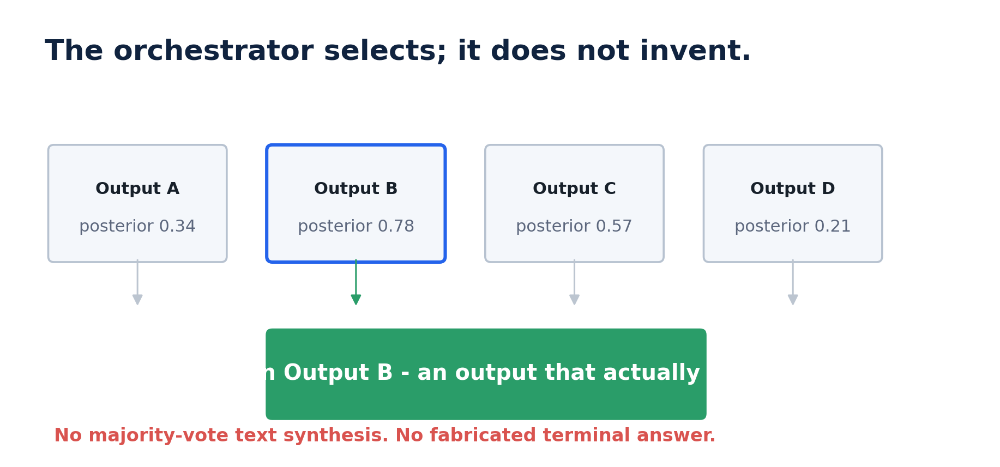
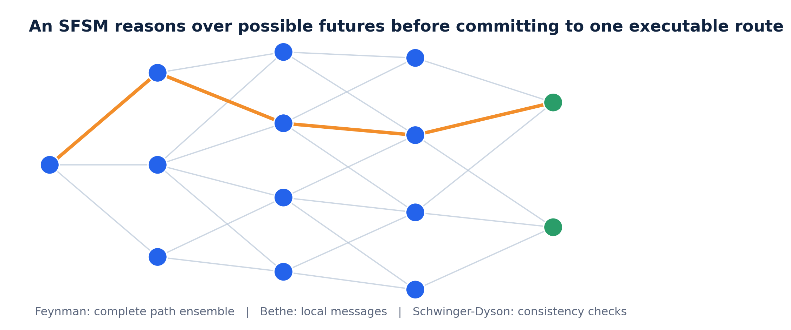
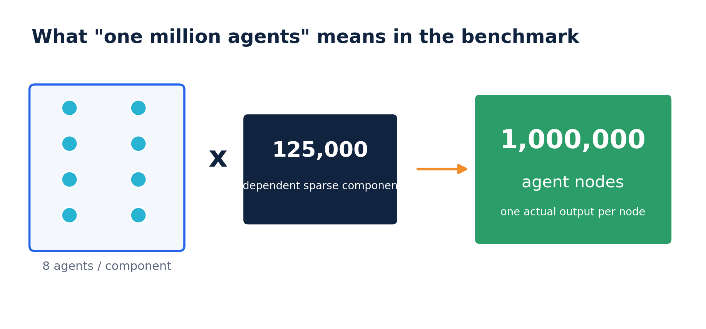
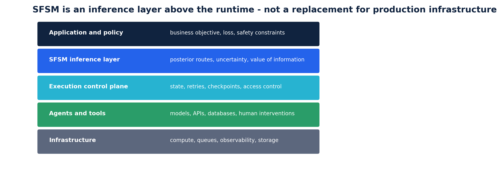

<p align="center"></p>

# Stochastic Orchestration for Partially Reliable Agents

## A procedural, structural and intuitive engineering white paper

**Angshul Majumdar · 2026**

> **Core idea:** Most agent systems are orchestrated as deterministic finite-state machines even though the agents themselves are only partially reliable. A stochastic finite-state machine keeps uncertainty explicit, updates it from evidence, and commits only when an executable action must be taken.

This self-contained Markdown document is the primary release artifact. It is written for software engineers, systems architects and technical leaders. It explains what the system does, why it is different from ordinary graph orchestration, how it scales to one million agent nodes, how the MapReduce implementation works, how to reproduce the results, and where the approach fits in a production stack.

---

## Executive summary

A conventional agent workflow has nodes, state and conditional edges. After a node returns an output, the orchestrator evaluates a rule and follows one edge. That is a **deterministic finite-state machine (FSM)** at the orchestration level. The tool or model may be stochastic, but the runtime commits to one realised branch.

A **stochastic finite-state machine (SFSM)** changes the orchestration semantics. It maintains a probability distribution over admissible next agents, states and outputs. Reliability priors, verifier scores, costs and dependency constraints update that distribution. The runtime still executes one action, but the action is selected from a posterior rather than a hard rule.

The release enforces a strict output contract:

> The final answer must be one of the outputs actually produced by an executed agent or tool.

The SFSM may select, reject, retry, verify, redirect or abstain. It may not fabricate a new terminal answer by voting over text or averaging outputs. This makes the benchmark a test of orchestration rather than ensemble synthesis.

The reference experiment contains **125,000 independent sparse components**, each with **eight agent nodes**, giving exactly **1,000,000 agent nodes per accuracy condition**. Both FSM and SFSM receive the same actual outputs and verifier evidence. The FSM uses a hard threshold policy. The SFSM selects the actual output with the highest posterior probability of correctness.

| Mean agent accuracy | FSM final accuracy | SFSM final accuracy | Gain |
|---:|---:|---:|---:|
| 20% | 56.05% | **65.96%** | **+9.91 pp** |
| 40% | 81.23% | **89.17%** | **+7.94 pp** |
| 60% | 92.50% | **96.75%** | **+4.25 pp** |
| 80% | 97.61% | **99.18%** | **+1.56 pp** |
| 100% | 100.00% | **100.00%** | **0.00 pp** |

The gain is largest where orchestration matters most: partially reliable agents. At perfect reliability there is no uncertainty to resolve, so both machines are identical.

---

## 1. FSM versus SFSM

<p align="center"></p>

### 1.1 Deterministic finite-state orchestration

An FSM workflow consists of:

- a current state;
- an agent or tool to execute;
- an observed output;
- a deterministic transition rule;
- a successor state.

Operationally:

```text
state -> execute node -> observe output -> evaluate condition -> follow one edge
```

This design is attractive because it is direct, inspectable and cheap. It is appropriate when outputs are reliable or when every relevant uncertainty has already been resolved before the transition rule runs.

Its weakness is not that it cannot call probabilistic models. It can. The weakness is that it converts an uncertain observation into a certain routing decision. Once the branch is chosen, alternatives are normally discarded. An early uncertain decision can therefore become a structural error propagated through the rest of the workflow.

### 1.2 Stochastic finite-state orchestration

An SFSM stores a probability distribution over the transitions that remain plausible. It combines:

- empirical agent reliability;
- verifier or critic scores;
- latency and monetary cost;
- safety and policy constraints;
- prerequisites and shared resources;
- downstream utility;
- evidence accumulated during the current run.

Operationally:

```text
state + evidence -> update transition probabilities -> choose one executable action
```

The runtime still executes one agent or one tool. The difference is the decision procedure used to select it.

### 1.3 Why this is not a software-framework comparison

The scientific comparison is **FSM versus SFSM**. LangGraph, LangChain and similar libraries are convenient development mechanisms for expressing stateful graphs and conditional edges. They implement an FSM-style execution pattern; they are not a distinct mathematical baseline.

This repository therefore implements the FSM directly. It deliberately excludes framework-specific callback, serialization, checkpoint, tracing and persistence overhead. The benchmark isolates orchestration semantics.

In a production system, framework code may be embedded inside an application, rewritten as service logic, or hosted by a managed cloud control plane. Microsoft Foundry, Google Vertex AI Agent Engine and Amazon Bedrock AgentCore all distinguish agent logic from the managed infrastructure that supplies hosting, scaling, identity, state and observability. The SFSM layer described here belongs above that infrastructure.

---

## 2. The actual-output contract

<p align="center"></p>

A common but misleading benchmark lets an orchestrator combine several answers into a new majority-vote answer. That tests answer synthesis. It does not test routing or orchestration.

This release uses a stricter invariant:

```text
terminal_result = outputs[selected_output_index]
```

The selected index must lie within the outputs actually produced for that task. The code checks this boundary and rejects out-of-range selections.

### 2.1 What the orchestrator may do

The orchestrator may:

- accept the present output;
- choose a different actual output;
- call a verifier;
- retry an agent;
- redirect to another tool;
- escalate to a stronger agent;
- abstain or ask for human intervention.

### 2.2 What it may not do

It may not claim that an unexecuted tool produced a result. It may not create a new output and then credit orchestration for the accuracy of that synthesis.

This distinction matters for APIs, databases, code execution, payments, infrastructure operations and other irreversible actions. In those systems, the output either exists in the execution log or it does not.

### 2.3 Why evidence is necessary

If every agent has identical reliability and the orchestrator has no diagnostic evidence, choosing among outputs cannot improve expected accuracy. The SFSM becomes useful when correctness correlates with observable evidence such as:

- verifier confidence;
- self-consistency features;
- agent-specific reliability history;
- tool-return metadata;
- route history;
- latency or failure signals;
- agreement with trusted constraints.

The benchmark provides such evidence through verifier scores whose distributions differ for correct and incorrect outputs.

---

## 3. The path-ensemble intuition

<p align="center"></p>

An FSM represents one realised route. An SFSM represents an ensemble of possible routes until evidence justifies commitment.

Think of each complete workflow as a path through a graph. A path records:

- which agents were selected;
- which states were visited;
- what evidence was observed;
- which retries or verification calls occurred;
- what cost was paid;
- which terminal output was returned.

Every path receives a weight determined by its reliability, evidence, cost and constraints. The normalized weights form a probability distribution over trajectories.

Three computational views operate on this same model.

### 3.1 Global path view

The global view answers questions such as:

- What is the probability of terminal success?
- Which routes remain plausible?
- What is the expected cost of continuing?
- How often is a particular tool likely to be called?
- Which output should be returned under the chosen loss function?

The exact global sum is conceptually clean but cannot be evaluated by enumerating every path in a large system.

### 3.2 Local message view

The path model is factorized into local dependencies. A factor may encode:

- a transition rule;
- a verifier likelihood;
- an agent reliability prior;
- a prerequisite;
- a shared resource;
- a safety restriction;
- a cost or latency penalty.

Messages summarize what one region tells a neighbouring region. Sparse graphs allow these updates to be performed locally and in parallel.

### 3.3 Consistency-residual view

Local approximations become unreliable around strong loops. The system therefore computes consistency residuals derived from exact probability identities. Large residuals identify where the current local approximation is missing important cyclic dependence.

The system does not apply expensive correction everywhere. It concentrates correction on the small cyclic core that matters.

### 3.4 Feedback correction

Condition on a small set of loop variables. Once those variables are fixed, the remaining graph becomes a collection of trees or forests. Tree inference is exact and linear in the size of the forest. Each conditioning assignment can be solved independently, which leads naturally to MapReduce.

### 3.5 The complete inference cycle

The global, local and residual views are not separate modes chosen by an operator. They form one execution cycle.

1. **Compile the current workflow frontier.** Convert eligible agents, tool states, verifier observations and constraints into a sparse factor graph.
2. **Initialize local beliefs.** Reuse messages from the previous step wherever the graph has not changed.
3. **Run local message updates.** Each partition exchanges compact boundary messages rather than complete histories.
4. **Measure residuals.** Identify regions where local consistency is insufficient because a loop couples several decisions.
5. **Correct only those regions.** Condition on a small feedback set or enlarge the local region.
6. **Compute action risk.** Evaluate accept, verify, retry, redirect and abstain using the corrected posterior.
7. **Execute one real action.** The production runtime performs the selected call.
8. **Incorporate the returned evidence.** Update the frontier and repeat.

The important systems point is that the expensive global model is never rebuilt from scratch. Most workflow steps change only a small neighborhood. The implementation should preserve messages and cached separator factors across steps, invalidate only affected regions, and propagate updates until the change falls below a tolerance.

A useful mental model is an incremental build system. A deterministic orchestrator executes a fixed dependency graph. The SFSM additionally tracks which uncertain dependencies have changed and recomputes only the consequences of those changes.

---

## 4. Structural architecture

<p align="center"></p>

The implementation scales by exploiting structure. It never creates a dense one-million-by-one-million transition matrix and never enumerates all complete trajectories.

### Layer 1: sparse factorization

Dependencies are represented as local factors rather than a global transition table. If each agent depends on only a small number of neighbours, total storage grows approximately with the number of edges, not with the square of the number of agents.

### Layer 2: active frontier

At any moment, only a fraction of the registered agents can affect the next decision. The online system keeps an active frontier containing:

- currently eligible agents;
- their prerequisites;
- likely successors;
- nearby verifiers and recovery paths;
- separator variables connecting active regions.

Dormant agents remain in the registry but do not participate in every inference update.

### Layer 3: local parallel messages

Most factor-graph messages depend only on neighbouring messages. Regions can therefore be updated concurrently. Communication is limited to boundary beliefs rather than complete trajectories.

### Layer 4: residual-guided correction

Consistency residuals rank loops by their effect on the posterior. High-residual regions receive additional computation. Low-residual regions retain the cheap local approximation.

### Layer 5: feedback conditioning

The remaining cyclic core is broken by conditioning on a small feedback set. Exact tree inference is then run for every assignment of the conditioned variables. Cost is exponential in feedback width, not in total graph size.


### Data structures that make the scale claim real

A million-agent implementation must be sparse in both mathematics and memory representation. The reference design uses the following structures.

| Object | Recommended representation | Reason |
|---|---|---|
| Agent registry | compact integer IDs plus metadata table | IDs move cheaply through arrays and messages |
| Workflow edges | compressed sparse row or adjacency arrays | memory grows with actual edges, not all possible pairs |
| Factor parameters | typed records grouped by factor family | avoids a Python object per edge |
| Belief messages | dense vectors only for local state cardinality | message size depends on local state, not graph size |
| Active frontier | bitmap or sorted integer set | fast activation, retirement and neighborhood expansion |
| Separator messages | contiguous arrays keyed by partition boundary | efficient serialization and reduction |
| Evidence log | append-only event stream | replay, audit and recalibration |
| Large agent output | object-store reference plus compact features | prevents transcripts from entering the probabilistic state |

The implementation should not create one process, thread or Python object for every agent. A million agents are data records. Workers operate on blocks of records. Concurrency is assigned to graph partitions or batches, not to individual nodes.

### State cardinality matters as much as node count

A sparse graph can still be expensive if every variable has a huge state space or if factors involve many variables. The practical complexity is controlled by three quantities:

- number of active variables;
- maximum local state cardinality;
- maximum factor or separator width.

An engineering design should therefore compress orchestration state aggressively. Store only fields that alter future routing, loss or admissibility. Raw prompts, complete model traces and tool payloads should remain outside the inference state unless a compact feature is insufficient.

### The practical scaling principle

> Scale the structure, not the path count.

Large tree-like delegated branches are cheap. Dense strongly coupled cores remain expensive. The engineering objective is to keep the active frontier, separator width and feedback width small.

---

## 5. Million-agent workload

<p align="center"></p>

The reference workload contains:

- 125,000 independent output-selection components;
- 8 agent nodes per component;
- exactly 1,000,000 agent nodes per accuracy condition;
- mean agent accuracies of 20%, 40%, 60%, 80% and 100%;
- 10 deterministic test seeds;
- 7 timing repetitions per seed;
- 4 MapReduce workers in the reference configuration.

This is a block-sparse graph, not a fictitious dense million-node clique. The design measures million-node throughput while preserving a clear and auditable task structure.

### 5.1 Agent reliability

Within each component, agents have slightly different reliability values around the requested mean. This creates realistic heterogeneity without changing the mean condition.

### 5.2 Actual outputs

Each node produces one output. Correctness is known only to the evaluator. The orchestrators see:

- the output position;
- the agent reliability prior;
- a verifier score.

### 5.3 Verifier evidence

Correct outputs and incorrect outputs generate scores from different beta distributions:

- correct output score: `Beta(4, 2)`;
- incorrect output score: `Beta(2, 4)`.

The distributions overlap. A high score is evidence, not proof.

### 5.4 FSM policy

The FSM policy selects the first actual output whose score crosses a threshold tuned on an independent validation seed block. If no score crosses the threshold, it returns the first output.

```text
scan outputs in order
    if score >= threshold:
        return that actual output
return first actual output
```

This is a hard conditional-edge policy.

### 5.5 SFSM policy

The SFSM combines the agent prior with the score likelihood and computes posterior correctness for every actual output. It returns the output with maximum posterior correctness.

```text
for every actual output:
    posterior_score = prior_evidence + verifier_evidence
return actual output with maximum posterior_score
```

For the beta distributions used here, the implementation reduces to a stable log-odds computation.

---


### 5.6 Experimental data contract

Each benchmark row is fully determined by a configuration file and a random seed. The generated objects are:

```text
correct[component, agent]      evaluator-only correctness indicator
score[component, agent]        verifier evidence observed by both orchestrators
prior[component, agent]        calibrated reliability observed by the SFSM
selected_fsm[component]        index of one actual produced output
selected_sfsm[component]       index of one actual produced output
```

Correctness is hidden from both policies during selection. It is used only after selection to score the terminal result. This separation prevents label leakage.

The benchmark uses independent seeds for threshold tuning and test evaluation. The FSM threshold is chosen on a validation stream, then frozen before the test seeds are generated. The SFSM likelihood model is also fixed before test evaluation. Timing excludes simulated agent execution because the purpose of the table is to isolate orchestration-kernel cost.

The million-node claim is literal but should be interpreted correctly. The graph contains 125,000 independent sparse output-selection components with eight agent nodes each. This arrangement tests throughput, memory layout and embarrassingly parallel execution. It is not a claim that one decision couples all one million nodes. Dense global coupling would be a different and much harder workload.

## 6. Accuracy results

<p align="center"></p>

| Mean agent accuracy | FSM mean | FSM standard deviation | SFSM mean | SFSM standard deviation | Gain |
|---:|---:|---:|---:|---:|---:|
| 20% | 56.05% | 0.15% | **65.96%** | 0.11% | **+9.91 pp** |
| 40% | 81.23% | 0.12% | **89.17%** | 0.13% | **+7.94 pp** |
| 60% | 92.50% | 0.06% | **96.75%** | 0.04% | **+4.25 pp** |
| 80% | 97.61% | 0.03% | **99.18%** | 0.03% | **+1.56 pp** |
| 100% | 100.00% | 0.00% | **100.00%** | 0.00% | 0.00 pp |

### 6.1 What the numbers mean

At 20% mean reliability, many outputs are wrong. The hard FSM often commits to an early output whose score happens to cross the threshold. The SFSM compares all actual candidates using both prior reliability and score evidence, improving final selection by 9.91 percentage points.

As agent reliability rises, most components already contain several strong outputs. The FSM becomes less vulnerable to early mistakes and the available improvement narrows.

At 100% reliability, every output is correct. Both methods achieve 100%. The SFSM does not claim an advantage when no uncertainty exists.

### 6.2 What the numbers do not mean

The results do not mean that stochastic routing can create correctness from nothing. Improvement depends on informative evidence and a reasonably calibrated model. If verifier scores are unrelated to correctness, posterior selection has no basis for improvement.

The results also do not establish tractability for every possible million-node graph. Dense high-treewidth systems remain difficult.

---

## 7. MapReduce implementation

<p align="center"></p>

MapReduce is used because the workload contains independent row partitions and because conditioned forest subproblems are independent once separator assignments are fixed.

### 7.1 Map phase

The mapper receives a row range. It opens read-only memory maps containing verifier scores and reliability priors, computes SFSM selections for its rows, and returns compact summaries.

The reference implementation returns:

- the sum of selected output indices as a checksum;
- the number of processed components.

A production implementation could return richer aggregates, marginals or selected actions.

### 7.2 Reduce phase

The reducer combines worker summaries:

```text
global_checksum = sum(worker_checksums)
global_count    = sum(worker_counts)
```

For full probabilistic inference, the reducer would combine partition functions and normalized marginal contributions rather than checksums.

### 7.3 Why memory mapping is used

Passing a million-node array to every process would cause unnecessary serialization and memory duplication. The implementation writes arrays once as read-only NumPy memory maps. Each worker opens the same files and reads only its row partition.

This design:

- avoids copying complete arrays into every process;
- works with the `spawn` multiprocessing model;
- is portable across Linux, macOS and Windows;
- makes worker inputs deterministic and auditable.

### 7.4 Correctness guard

Every distributed run is compared with serial SFSM selection. The benchmark aborts unless:

- the distributed component count equals the serial count;
- the distributed output-index checksum equals the serial checksum.

The tests also compare exact selected indices on reduced workloads.

### 7.5 Current MapReduce path

```text
scores + priors
      |
      v
write read-only memory maps
      |
      v
partition component rows
      |
      +--------+--------+--------+
      |        |        |        |
   worker 1 worker 2 worker 3 worker 4
      |        |        |        |
      +--------+--------+--------+
               |
               v
       reduce checksums/counts
               |
               v
       verify against serial SFSM
```

---


### 7.6 Map records and reduce records

A production implementation should make the distributed contract explicit. For independent output-selection blocks, a mapper can emit:

```text
component_start
component_stop
selected_output_indices
local_checksum
processed_count
elapsed_time
```

For feedback-conditioned exact inference, a mapper instead emits:

```text
feedback_assignment
log_partition_contribution
requested_marginal_numerators
diagnostic_residuals
processed_factor_count
```

The reducer never needs raw agent text. It combines compact numerical summaries. Partition contributions should be carried in the log domain and reduced with log-sum-exp to avoid underflow.

### 7.7 Determinism and fault recovery

Every map task is a pure function of:

- immutable graph partition;
- immutable model parameters;
- immutable evidence snapshot;
- explicit random seed, when sampling is used.

This makes retries safe. A failed mapper can be rerun without changing the result. Duplicate outputs are removed by task identifier. Reducers should validate counts, shape metadata and checksums before publishing a result.

### 7.8 What changes in a real distributed engine

The included implementation uses memory-mapped NumPy arrays and a process pool because it runs on an ordinary workstation. The same decomposition maps directly to a cluster:

| Reference implementation | Cluster implementation |
|---|---|
| memory-mapped file | distributed object store or shared filesystem |
| process-pool worker | container, batch task or actor |
| Python tuple result | typed binary record |
| local checksum reduce | distributed aggregation tree |
| local temporary directory | versioned run namespace |

The mathematics does not depend on the execution engine. Spark, Ray, Dask, Kubernetes jobs, cloud batch systems or custom C++ services can implement the same map and reduce contracts.

## 8. Timing and worker scaling

<p align="center"></p>

The timing scope includes orchestration selection only. Agent execution, model/API latency and output generation are excluded because they would hide the algorithms being compared.

| Mean agent accuracy | FSM | SFSM serial | SFSM MapReduce, 4 workers | Serial-to-MapReduce speed-up |
|---:|---:|---:|---:|---:|
| 20% | 5.36 ms | 13.87 ms | **5.30 ms** | 2.62× |
| 40% | 4.44 ms | 11.09 ms | **4.29 ms** | 2.58× |
| 60% | 4.43 ms | 10.20 ms | **4.10 ms** | 2.49× |
| 80% | 4.42 ms | 10.46 ms | **4.39 ms** | 2.38× |
| 100% | 2.24 ms | **0.14 ms** | 0.53 ms | 0.27× |

At 100% reliability, the SFSM implementation recognizes that all priors equal one and returns the first output directly. Serial execution is therefore faster than process-based MapReduce. This is expected: parallelism has overhead and should not be used for trivial work.

<p align="center"></p>

| Workers | Time | Speed-up | Parallel efficiency |
|---:|---:|---:|---:|
| 1 | 11.50 ms | 1.00× | 1.00 |
| 2 | 8.86 ms | 1.30× | 0.65 |
| 3 | 9.27 ms | 1.24× | 0.41 |
| 4 | **4.04 ms** | **2.85×** | 0.71 |
| 5 | 5.66 ms | 2.03× | 0.41 |

Worker scaling is not monotonic because process startup, scheduling and memory bandwidth matter. Four workers were best on the reference machine. A production deployment should choose worker count empirically or use a long-lived worker pool.

Timing values are machine-specific. Accuracy is compared numerically against frozen references; timing is rerun and reported with host metadata.

---

## 9. Production-stack placement

<p align="center"></p>

The SFSM is an inference and decision layer. It is not a replacement for production infrastructure.

### 9.1 The SFSM layer owns

- posterior route probabilities;
- reliability and verifier calibration;
- expected loss and utility;
- retry, verification and abstention decisions;
- active-frontier inference;
- loop diagnostics;
- selected agent, tool or actual output index.

### 9.2 The production runtime owns

- credentials and identity;
- network isolation;
- queues and concurrency;
- checkpoints and durable state;
- rate limits and budgets;
- retries at the transport layer;
- observability and audit logs;
- deployment, rollback and versioning;
- secure tool execution.

### 9.3 Frameworks and managed platforms

LangGraph-style libraries express nodes, shared state and conditional edges. They are examples of FSM-style graph execution. In production, the orchestration code is commonly embedded in an application or hosted by a managed control plane.

Official platform documentation makes this split explicit:

- Microsoft Foundry Hosted Agents accepts LangGraph or custom code while the platform supplies endpoints, scaling, identity, persistent state and observability.
- Google Vertex AI Agent Engine deploys, manages and scales agents in production.
- Amazon Bedrock AgentCore describes the production harness as compute, isolation, identity, state, scaling and observability around the agent loop.

The SFSM can run above custom code or any of these managed platforms. It produces a decision; the control plane executes it securely.

---


### 9.4 Example production topology

A realistic deployment separates five responsibilities.

```text
API / event ingress
        |
        v
production workflow runtime -----> tool and agent services
        |
        +---- state events ----> evidence log / feature service
        |
        v
SFSM decision service
        |
        +---- sparse message workers
        +---- residual and feedback workers
        +---- calibration model store
        |
        v
selected action returned to workflow runtime
```

The workflow runtime remains authoritative for execution. The SFSM service is authoritative for probabilistic route selection. The evidence log is authoritative for what was known when a decision was made. Keeping these responsibilities separate makes rollback and shadow deployment possible.

### 9.5 Service-level interface

A minimal online request can be represented as:

```json
{
  "workflow_id": "wf-314",
  "state_version": 27,
  "eligible_actions": ["accept:3", "verify:3", "retry:2", "escalate:7"],
  "evidence_features": {
    "verifier_score_3": 0.71,
    "agent_3_reliability": 0.64,
    "retry_count_2": 1,
    "budget_remaining": 0.38
  },
  "deadline_ms": 40
}
```

The response should contain both the executable decision and enough metadata for audit:

```json
{
  "action": "verify:3",
  "decision_id": "d-8841",
  "posterior_success": 0.82,
  "expected_loss": 0.11,
  "fallback": "accept:3",
  "model_version": "sfsm-2026-08-01",
  "evidence_version": 27
}
```

Do not transmit full model prompts or confidential tool payloads unless the probabilistic model genuinely requires them. The decision layer normally needs compact features, identifiers and costs.

## 10. Procedural integration guide

### Step 1: define the orchestration state

Include only variables needed for routing, safety, cost and verification. Avoid placing entire transcripts into the discrete state. Large content belongs in external storage with compact references or learned features.

Typical state fields:

```text
request_id
current_stage
completed_prerequisites
candidate_agents
retry_counts
budget_remaining
safety_flags
verifier_features
selected_output_index
```

### Step 2: instrument agents and tools

Record:

- empirical success rate by task type;
- latency distribution;
- cost;
- failure and timeout rate;
- verifier or critic features;
- correlations with other agents;
- route context.

Do not treat a single global accuracy value as permanent truth. Reliability is conditional on task and environment.

### Step 3: compile sparse factors

Translate system knowledge into local factors:

- prerequisites;
- mutually exclusive actions;
- shared resources;
- cost penalties;
- safety restrictions;
- verifier likelihoods;
- terminal utility.

Keep factors small. If one factor touches thousands of variables, search for a separator, hierarchy or sufficient statistic.

### Step 4: maintain the active frontier

After each actual tool return:

1. update the state;
2. activate newly eligible agents;
3. retire irrelevant regions;
4. update local messages near the changed evidence;
5. propagate boundary messages only as far as necessary.

### Step 5: compute residuals

Measure consistency violations in cyclic regions. Use residual thresholds to decide when cheap local inference is insufficient.

### Step 6: correct selectively

For a high-residual region:

- identify a small feedback set;
- condition on feedback assignments;
- solve resulting forests in parallel;
- combine the conditioned results.

### Step 7: choose by expected loss

The best decision is not always the output with highest raw confidence. The action should minimize expected loss under operational costs and safety constraints.

Possible decisions:

```text
accept output 3
verify output 3
retry agent 2
call stronger agent 7
abstain and request human review
```

### Step 8: execute and log

The runtime executes one action. Store:

- evidence available at decision time;
- posterior or score summary;
- selected action;
- selected actual output index;
- tool result;
- cost and latency;
- eventual correctness when available.

This creates the data required for recalibration.

---

## 11. Implementation anatomy

### Package layout

```text
src/sfsm_orchestration/
    core.py          # data generation, FSM policy, SFSM posterior and selection
    distributed.py   # memory-mapped MapReduce selection
    benchmark.py     # full experiment runner
    verify.py        # numerical reference verification
```

### Core API

```python
from sfsm_orchestration.core import (
    BenchmarkConfig,
    generate_agent_graph,
    fsm_select,
    sfsm_select,
    accuracy,
)
```

### Distributed API

```python
from sfsm_orchestration.distributed import mapreduce_checksum
```

### Serial selection

```python
fsm_indices = fsm_select(scores, threshold)
sfsm_indices = sfsm_select(scores, priors)
```

Both return one integer output index per component.

### Distributed selection

```python
checksum, count, elapsed_ms = mapreduce_checksum(
    scores=scores,
    priors=priors,
    workers=4,
    repeats=7,
)
```

The benchmark verifies the distributed checksum and count against serial selection before recording results.

---


### Configuration files

The experiment configuration is JSON so that every numerical claim has an inspectable source. Important fields include:

```json
{
  "accuracies": [0.2, 0.4, 0.6, 0.8, 1.0],
  "components": 125000,
  "agents_per_component": 8,
  "test_seeds": 10,
  "timing_repeats": 7,
  "workers": 4,
  "master_seed": 20260730,
  "correct_beta": [4.0, 2.0],
  "incorrect_beta": [2.0, 4.0]
}
```

The quick profile reduces components, seeds and repeats but preserves the same code path.

### Result files

The principal outputs are:

| File | Contents |
|---|---|
| `million_agent_raw.csv` | one row per accuracy and test seed |
| `million_agent_accuracy.csv` | aggregated accuracy means, deviations and gains |
| `million_agent_time.csv` | FSM, serial SFSM and MapReduce timing |
| `worker_scaling.csv` | worker count, elapsed time, speedup and efficiency |
| `metadata.json` | configuration, platform, thresholds and experiment contract |
| `benchmark_results.csv` | exactness and approximation results on loopy factor graphs |
| `bruteforce_validation_results.csv` | direct-enumeration verification on small instances |

### Executable entry points

```text
python experiments/run_all.py --profile quick
python experiments/run_all.py --profile full
python experiments/run_million_agent.py --config experiments/configs/full.json
python experiments/run_worker_scaling.py --config experiments/configs/full.json
python experiments/benchmark_fbs.py --help
python experiments/validate_trifecta.py
```

The package also exposes `sfsm-benchmark` and `sfsm-verify` console commands after installation.

## 12. Reproduce the release

### 12.1 Local environment

```bash
python -m venv .venv
source .venv/bin/activate
python -m pip install -r requirements-dev.txt
python -m pip install -e . --no-build-isolation --no-deps
```

On Windows PowerShell:

```powershell
python -m venv .venv
.venv\Scripts\Activate.ps1
python -m pip install -r requirements-dev.txt
python -m pip install -e . --no-build-isolation --no-deps
```

### 12.2 Run semantic and distributed tests

```bash
make test
```

The tests check:

- output indices always refer to actual generated outputs;
- serial and MapReduce selection agree;
- configuration and data-shape invariants hold.

### 12.3 Run a reduced smoke benchmark

```bash
make quick
```

Use this to verify installation, multiprocessing and output generation.

### 12.4 Run the complete experiment

```bash
make reproduce
```

This runs:

- the million-agent FSM/SFSM benchmark;
- worker-scaling measurement;
- exactness benchmarks;
- brute-force validation;
- consistency validation;
- figure generation.

Full results are written to `results/generated/`. Frozen references remain under `results/reference/`.

### 12.5 Verify regenerated results

```bash
make verify
```

Accuracy is checked against the frozen reference within Monte Carlo tolerance. Timing is validated for schema and positivity because it varies by machine.

### 12.6 Regenerate figures

```bash
make figures
```

Generated plots are written to `results/generated/figures/`.

### 12.7 Docker

```bash
docker build -t sfsm-orchestration .
docker run --rm sfsm-orchestration
```

The container runs the reduced reproducibility path suitable for environment isolation.

---


### 12.8 Exactness and consistency validation

The million-agent benchmark tests routing quality and throughput. A separate validation suite tests the Feynman-Bethe-Schwinger-Dyson solver itself.

The suite generates sparse binary pairwise models with controlled loop count and coupling strength. For small instances it enumerates every assignment and compares partition functions and marginals. For larger instances it compares hard routing, mean field, Gibbs sampling, loopy Bethe and feedback-conditioned exact inference.

Run only the direct-enumeration check with:

```bash
python experiments/benchmark_fbs.py \
  --out-dir results/generated/exactness/bruteforce \
  --sizes 16 --loops 2 4 6 --strengths .4 .8 1.2 \
  --seeds 10 --brute-n 16
```

A successful run should report floating-point-level agreement between feedback conditioning and brute force. Approximate baselines are not expected to match exactly.

### 12.9 Reproduction expectations

Accuracy results should agree statistically, not bit-for-bit across all NumPy versions and processors. Timing is inherently machine dependent. The repository therefore uses three different checks:

1. deterministic semantic tests for output admissibility and serial/distributed equivalence;
2. tolerance-based checks for Monte Carlo accuracy summaries;
3. schema, finiteness and positivity checks for timing tables.

A slower machine does not invalidate the experiment. A different selected-output checksum under the same arrays does.

## 13. Repository map

```text
README.md                       GitHub landing page and fast-start commands
WHITEPAPER.md                   complete visual engineering white paper
TECHNICAL_PAPER.md              full theorem-and-proof paper in Markdown
ARCHITECTURE.md                 structural and runtime architecture
REPRODUCIBILITY.md              exact experiment contract and commands
IMPLEMENTATION_GUIDE.md         integration and extension guide
src/sfsm_orchestration/         installable serial and distributed implementation
experiments/run_all.py          one-command experiment orchestrator
experiments/run_million_agent.py complete million-agent runner
experiments/run_worker_scaling.py worker-scaling experiment
experiments/benchmark_fbs.py     exactness and approximation benchmark
experiments/validate_trifecta.py independent consistency validator
experiments/configs/            quick and full configurations
results/reference/              frozen raw and aggregate results
figures/                        all white-paper and result figures in PNG/SVG
social/                         LinkedIn banner and release copy
scripts/bootstrap.sh            environment bootstrap helper
tests/                          semantic and distributed-equivalence tests
Dockerfile                      isolated quick reproduction
environment.yml                 Conda environment
requirements*.txt               pinned Python dependencies
pyproject.toml                  installable package and CLI metadata
CITATION.cff                    citation metadata
SHA256SUMS                      release integrity manifest
```

---

## 14. Engineering boundaries

This release makes specific claims and leaves clear boundaries.

### It does claim

- FSM and SFSM are different orchestration semantics.
- A calibrated SFSM can select better actual outputs under partial reliability.
- Sparse structure avoids trajectory enumeration.
- Independent partitions and feedback assignments can be parallelized.
- The provided million-node benchmark is reproducible.

### It does not claim

- every verifier is calibrated;
- every dense graph is tractable;
- stochastic inference replaces production security;
- MapReduce always accelerates small workloads;
- one benchmark represents every agentic application;
- a posterior can repair a misspecified model automatically.

### Principal risks

1. **Miscalibration:** wrong priors or likelihoods can create confident errors.
2. **Hidden correlation:** apparently independent agents may share training data, prompts or failure modes.
3. **Dense cyclic cores:** feedback width can become too large for exact conditioning.
4. **Distribution shift:** reliability learned on one workload may fail on another.
5. **Uninformative evidence:** if verifier scores do not correlate with correctness, SFSM selection cannot improve.
6. **Operational mismatch:** an accurate posterior is useless if the execution layer ignores the selected action or loses state.

---


### Troubleshooting guide

| Symptom | Likely cause | Corrective action |
|---|---|---|
| multiprocessing hangs on Windows | entry point was not protected | run the provided scripts, not an unguarded notebook cell |
| MapReduce slower than serial | workload too small or storage too slow | increase partition size, reuse workers, exclude setup from kernel timing |
| accuracy differs materially | dependency or seed mismatch | inspect `metadata.json`, environment versions and configuration |
| out-of-memory error | too many arrays copied into workers | use memory maps or shared memory and smaller batches |
| selected output index mismatch | policy or posterior implementation changed | run unit tests and compare serial checksum before timing |
| Bethe messages oscillate | strong loops or insufficient damping | increase damping, use residual scheduling, condition the cyclic core |
| confident but wrong routes | model or verifier miscalibration | recalibrate on held-out execution logs and monitor reliability diagrams |
| correction cost explodes | feedback or separator width is large | partition hierarchically, approximate the region, or impose a budget |

### Security and governance boundaries

The SFSM is a decision system and should be governed as one. Production deployments should record model version, evidence version, selected action, fallback, expected loss and operator overrides. Sensitive evidence should be feature-minimized. Reliability statistics should be segmented by task class so that one agent's success in low-risk summarization does not justify high confidence in infrastructure modification.

Human review should remain an admissible action. The posterior should not be permitted to override hard safety policies. Zero-valued factors or external policy gates should make forbidden transitions impossible regardless of learned confidence.

## 15. Recommended production rollout

### Phase 1: shadow mode

Run the SFSM beside the existing FSM without changing actions. Compare:

- selected route;
- predicted success probability;
- actual outcome;
- additional latency;
- calibration.

### Phase 2: low-risk selection

Allow SFSM decisions only for reversible or read-only tools. Preserve an FSM fallback.

### Phase 3: verifier and retry control

Permit the SFSM to request additional verification or retries under explicit cost limits.

### Phase 4: broader routing

Enable route selection for higher-impact actions after calibration and safety review.

### Phase 5: continuous recalibration

Update reliability models from execution logs. Monitor drift, residuals and abstention frequency.

---


## 16. Theory-to-implementation map

The complete theorem statements and proofs are in [TECHNICAL_PAPER.md](TECHNICAL_PAPER.md). The following map explains why the engineering components exist.

| Mathematical result | Engineering consequence |
|---|---|
| deterministic inclusion and strictness | an existing FSM is a boundary case; migration can be incremental |
| no-information impossibility | do not expect gains without informative evidence |
| Bayes-optimal actual-output selection | rank actual outputs by posterior correctness or expected loss |
| oracle ceiling | use the probability that at least one output is correct as an unattainable upper bound |
| calibration-regret bound | quantify the cost of misspecified priors and verifier likelihoods |
| Gibbs variational principle | inference is optimization over normalized trajectory laws |
| Bethe tree exactness | tree and chain regions need only local message passing |
| Schwinger-Dyson residual certificate | residuals can indicate where local closure is wrong |
| feedback-conditioned exactness | condition the cyclic core and solve remaining forests exactly |
| filtering sufficiency | retain the current belief state rather than the entire history |
| frontier truncation bound | safely drop low-mass inactive regions under a controlled error budget |
| exact separator reduction | replace a solved subgraph by a compact boundary factor |
| active-frontier fixed-parameter complexity | cost depends on frontier and loop width rather than registry size alone |
| asynchronous contraction | distributed messages converge under a contractive regime |
| quantized-message stability | finite-precision communication produces bounded belief error |
| MapReduce exactness | independent conditioned subproblems can be mapped and exactly recombined |
| work-span bound | estimate parallel wall time from total work and longest dependency chain |
| idempotent fault recovery | failed map tasks can be retried without changing the mathematical result |

This table is also a design checklist. An implementation that claims the same architecture should identify which theorem justifies each optimization and which assumption the production workload must satisfy.

---

## 17. Release references

The following sources clarify the distinction between agent logic and production hosting infrastructure:

1. **Microsoft Foundry Agent Service — Hosted agents.** Open-source frameworks or custom code are packaged and hosted while the platform supplies scaling, identity, persistence, observability and lifecycle management.  
   <https://learn.microsoft.com/en-us/azure/foundry/agents/concepts/hosted-agents>

2. **Google Cloud — Vertex AI Agent Engine overview.** Agent Engine is described as a managed service for deploying, managing and scaling agents in production.  
   <https://cloud.google.com/vertex-ai/generative-ai/docs/reasoning-engine/overview>

3. **Amazon Bedrock AgentCore — Agent harness.** AWS separates the agent loop from the production harness providing compute, isolation, identity, state, scaling and observability.  
   <https://docs.aws.amazon.com/bedrock-agentcore/latest/devguide/harness.html>

The mathematical and implementation details in this release are grounded in the accompanying source code, frozen result tables and exactness-validation scripts contained in the repository.

---

## 18. Final takeaway

Deterministic graph orchestration assumes that each observed output can be converted immediately into one hard transition. That assumption is increasingly fragile as systems delegate work to partially reliable agents.

An SFSM does not remove uncertainty. It represents it, propagates it and uses it to choose the next real action. Sparse factorization keeps most inference local. Residual-guided correction concentrates expensive work on the cyclic core. MapReduce distributes independent partitions and conditioned subproblems. The production runtime remains responsible for secure execution.

The result is not another workflow framework. It is a probabilistic decision layer for workflows whose components cannot be treated as perfectly reliable.
